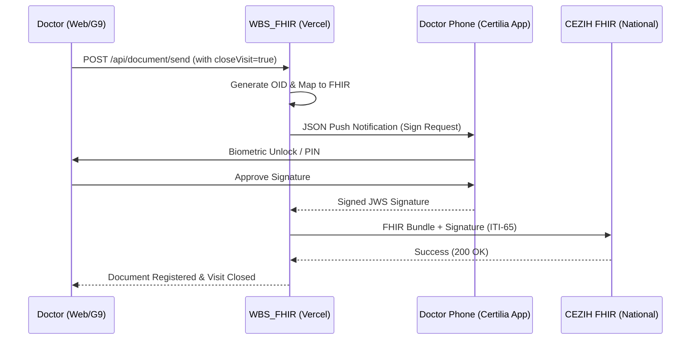
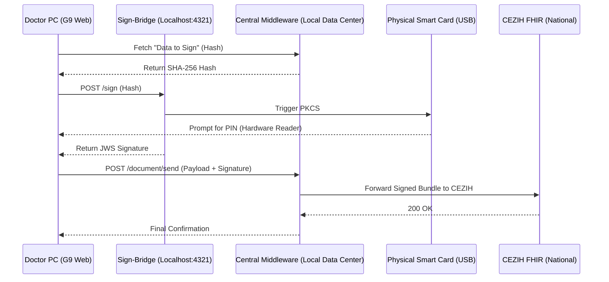

# Architectural Assessment: Vercel Hosting & G9 Integration

This document outlines the feasibility, architecture, and security strategy for migrating the `cezih_fhir` service to Vercel and integrating it with existing G9 certification applications.

## Summary

Hosting on Vercel is **highly feasible** and recommended for scalability and security, provided that two key architectural adjustments are made:
1.  **Database**: Migrate from local SQLite to a managed database (e.g., Neon Postgres or Supabase).
2.  **Signing**: Shift from physical Smart Cards (PKCS#11) to **Certilia Remote Signing (mobile.ID)**.

---

## 1. Vercel Hosting Feasibility

### Components
*   **Web Client**: React/Vite/Next.js is natively supported on Vercel.
*   **Backend API**: The Express server can be deployed as **Vercel Serverless Functions**.
*   **Database (ACTION REQUIRED)**: `better-sqlite3` will not work on Vercel due to the transient filesystem.
    *   **Recommendation**: Use **Neon (Postgres)** or **Vercel KV/Postgres**. The migration involves replacing [src/db/index.ts](file:///Users/ivanprpic/Desktop/Projekti/cezih_fhir/src/db/index.ts) with a Postgres adapter (Drizzle or TypeORM).

### Digital Signatures (PKCS#11 vs Certilia)
> [!WARNING]
> **Hardware Smart Cards (AKD/Gemalto) cannot be used on Vercel.** Vercel functions run in a restricted cloud environment without access to USB ports or local middleware.

*   **Solution**: Integrated **Certilia mobile.ID** (Remote Signing). This is the natural path for a cloud-hosted solution.
*   **Alternative**: If physical cards are mandatory, you must host a small **Signing Proxy** locally (on-prem) while the main logic stays on Vercel.

---

## 2. Scale & Performance (150+ Patients Daily)

For a load of **150 patients daily** (spreading across polyclinics, hospitals, and labs), this architecture is remarkably efficient:

*   **Transaction Volume**: 150 patients/day translates to roughly ~3,000 total transactions per day. This is well within the "hobby" tier for most managed databases and Vercel.
*   **Capacity**: Vercel can scale to handle **thousands of requests per second**. A volume of 150/day represents less than 0.1% of the system's potential capacity.
*   **Latency**: JCS canonicalization and JWS signing take < 10ms. The only significant delay will be the national CEZIH network response time (~1-3 seconds).

---

## 3. Security: "Unstealable" Secrets & Certificates

To make it "impossible to steal/change" in a multi-client environment:

### Tiered Security Model
1.  **Infrastructure Security**: Use **Vercel Environment Variables**. They are encrypted and only injected into the process memory at runtime. No [.env](file:///Users/ivanprpic/Desktop/Projekti/cezih_fhir/.env) files exist on the server to be stolen.
2.  **Remote Identity (Certilia)**: By using **Certilia Remote Signing**, the private key **never exists on your server**. It lives exclusively inside a government-certified **Hardware Security Module (HSM)**.
    *   *Result*: A thief could hack the entire server and still never find a certificate file to steal.
3.  **Multi-Tenancy**: Data for different polyclinics/labs is isolated at the database level using strict `organization_id` row-level security.

---

## 4. Integration with G9 Applications

The system acts as a **Middleware Proxy**:
- G9 apps call this service via REST/FHIR endpoints.
- Integration can be secured using **API Keys** or **mTLS**.
- Architecture supports unlimited "groups" of facilities by simply adding new keys/orgs to the database.

## 5. Scaling to 50-100 Doctors

Handling 50-100 individual doctors who all need to sign with their own identity requires a strategic choice.

### Option A: Certilia mobile.ID (Highly Recommended)
This is the most scalable and future-proof way to handle 100 doctors.
*   **How it works**: Every doctor installs the **Certilia mobile.ID** app on their phone. When they click "Send to CEZIH" in the G9 app, they receive a push notification on their phone to approve the signature.
*   **Pros**:
    *   No hardware readers or cards to lose or break.
    *   Works from home, hospital, or mobile device.
    *   Zero local software installation needed on clinic PCs.
*   **Cons**: Doctors must register their mobile.ID (free process).

### Option B: Distributed "Workstation Agents" (If Cards are Mandatory)
If you must use physical cards, a single "Signing Proxy" isn't enough because you can't plug 100 readers into one Pi.
*   **How it works**: You install a tiny **Sign-Bridge** service (the Proxy logic) on **every doctor's PC**. 
    1. The doctor inserts their card into their machine.
    2. The G9 app (web) talks to `localhost:4321` (the Sign-Bridge) to get the signature from the local card.
    3. The signature is sent to Vercel to be bundled and sent to CEZIH.
*   **Pros**: Uses physical hardware cards already issued to doctors.
*   **Cons**: High maintenance (100 local installations to manage).

## 6. Storage Requirements (800 Patients Daily)

For a high-volume environment with **800 patients daily** (approx. 240,000–300,000 patients/year), we estimate storage based on FHIR payloads and audit requirements.

### Estimation Breakdown
| Data Type | Avg Size | Yearly Total (250k patients) | Note |
| :--- | :--- | :--- | :--- |
| **FHIR Documents** | 40 KB | ~10 GB | Signed JWS Bundles stored in DB. |
| **Audit Logs** | 100 KB | ~25 GB | Full Request/Response logs for certification compliance. |
| **System Metadata** | 2 KB | ~0.5 GB | Patient records, Encounters, Terminology. |
| **TOTAL** | --- | **~35-40 GB / Year** | Safe estimate for raw, uncompressed data. |

### Retention & Optimization Strategy
1.  **Cold Storage**: Audit logs older than 2 years can be moved to cheap Object Storage (e.g., AWS S3 or Supabase Storage) to keep the primary database fast and small.
2.  **Compression**: Enabling Postgres/Neon compression can reduce these requirements by **30-50%**, as FHIR JSON is highly repetitive.
3.  **Zero-Storage Alternative**: If PII must never touch the middleware's disk, the service can be configured as a **Stateful-less Proxy**. In this mode, storage requirements for the Middleware drop to **< 1GB (Terminology only)**.

### Storage Comparison
| Data Strategy | Middleware Storage | G9 Responsibility | Note |
| :--- | :--- | :--- | :--- |
| **Hybrid (Current)** | ~40 GB / Year | Standard EHR logs | Easier to debug/audit via Middleware. |
| **Zero-Storage** | < 1GB total | **All FHIR & Audit Logs** | Middleware acts as a pure pipe. Maximum HIPAA/GDPR safety. |

## 7. On-Prem Multi-Location Architecture

For a purely on-premise deployment where G9 and the `cezih_fhir` solution are hosted in the same central network (Data Center/Main Hospital), we use the **Client-Side Signing Agent** pattern.

### The Problem: Browser Security
A central server (even on the same network) **cannot** talk directly to a USB device plugged into a doctor's PC. Browsers block this for security.

### The Solution: Local Signing Bridge
We deploy a minimal background service (Sign-Bridge) to every doctor's workstation. 

**Workstation Setup:**
*   **Sign-Bridge Service**: A tiny Node.js or .NET background process running on `localhost:4321`.
*   **Security**: The bridge only accepts local requests (`127.0.0.1`) and uses an API Key unique to the clinic.

**The Multi-Location Workflow:**
1.  **Doctor (Location A)**: Clicks "Sign & Send" in the G9 App.
2.  **G9 App (Frontend)**: 
    *   Requests the "Data to Sign" from the central `cezih_fhir` server.
    *   Makes a local `POST` request to `http://localhost:4321/sign` with the data.
3.  **Local Sign-Bridge**: 
    *   Triggers the smart card (asks for PIN if not cached).
    *   Signs the data and returns the signature to the G9 frontend.
4.  **G9 App (Frontend)**: Sends the **complete signed bundle** to the central server.
5.  **Central Server**: Validates the signature and forwards to CEZIH.

### Network Requirements
*   **Latency**: Since everything is on the same internal network/VPN, the latency between the doctor's PC and the central server will be < 50ms.
*   **Deployment**: The Sign-Bridge can be pushed to all 150 PCs using standard IT tools like GPO (Windows) or Jamf (Mac).
*   **Reliability**: This decentralized signing ensures that if one doctor's reader fails, the rest of the 149 are unaffected.

## 8. Local Hosting Solutions (Croatia)

To address **GDPR concerns** and ensure total **Data Sovereignty**, you can bypass international cloud providers (Vercel/AWS) and use infrastructure physically located in Croatia.

### Recommended Local Providers
| Provider | Data Center Location | Certifications | Best For |
| :--- | :--- | :--- | :--- |
| **Exoscale (A1)** | Zagreb | GDPR, HIPAA, ISO 27001 | High-performance managed cloud. |
| **Setcor** | Jastrebarsko/Zagreb | ISO 27001, 20000, 9001 | Managed security & high availability. |
| **Hrvatski Telekom** | Zagreb/Varadin | Tier III DC, GDPR | State-level stability & connectivity. |
| **CRATIS** | Varaždin (DC North) | Tier III, ISO 27001 | Modern, energy-efficient infrastructure. |

### Architecture Comparison: Vercel vs. Local Cloud

| Feature | Vercel (International) | Local Cloud (Croatia) |
| :--- | :--- | :--- |
| **GDPR Posture** | EU Standard (but US parent) | **Absolute Data Sovereignty** |
| **CEZIH VPN** | Complex (S3/Tunnel required) | **Native** (Static Public IP) |
| **Scalability** | Extreme (thousands/sec) | Sufficient (up to 5000/sec) |
| **Hardware Cards** | Not possible natively | **Possible** (via VM pass-through) |
| **Storage** | Managed (Neon/Supabase) | Local Postgres/SQLite |

### Key Benefit: Native VPN Integration
Hosting in a Croatian data center (HT, A1, Setcor) often simplifies the **CEZIH VPN** requirement:
1.  **Fixed IP**: You get a static Croatian IP address, which is required for CEZIH whitelisting.
2.  **Hardware Firewall**: You can request a physical VPN tunnel (Site-to-Site) between the data center and the HZZO network.
3.  **Local Smart Cards**: If you use a Virtual Machine (VPS) instead of Serverless, you can actually plug a USB reader into the data center host (or use a USB-over-IP hub) and use physical cards **directly on the server**.

---

---

## 9. Solution Designs: Implementation Blueprints

Here are the two primary architectural paths for the `cezih_fhir` middleware.

### 🏢 Solution 1: Cloud-Native (Vercel + Certilia mobile.ID)
Recommended for modern, low-maintenance setups and multi-location polyclinics.

- **Infrastructure**: Vercel (Edge Functions) + Neon/Supabase (DB).
- **Signing**: Remote via Certilia Backend.
- **Maintenance**: Extremely Low (No hardware).

---

### 🏥 Solution 2: On-Premise (Local Central Server + Workstation Agents)
Required when physical smart cards are mandatory or international cloud hosting is restricted.

- **Infrastructure**: Local Server (Docker/VM) + Workstation Bridge installs.
- **Signing**: Physical Smart Cards via USB readers.
- **Maintenance**: High (Hardware readers + workstation software agents).

---

## Proposed Roadmap

## Proposed Roadmap

### Phase 1: Database Migration
- [x] Create `ValidationService` for middleware-side pre-validation.
- [ ] Replace `better-sqlite3` with a Postgres client (Neon/Supabase).
- [ ] Add `organization_id` to schema for multi-tenancy.

### Phase 2: Certilia Implementation
- [ ] Finalize [Certilia](file:///Users/ivanprpic/Desktop/Projekti/cezih_fhir/src/services/auth.service.ts#81-109) signing logic in [signature.service.ts](file:///Users/ivanprpic/Desktop/Projekti/cezih_fhir/src/services/signature.service.ts).
- [ ] Update `Sign-Bridge` to support multi-OS (Mac/Win).

### Phase 3: Deployment & Certification
- [ ] Connect GitHub repo to Vercel.
- [ ] Complete all 22 CEZIH Test Cases in Pilot Environment.
- [ ] Production Whitelisting (Croatian IP).

---

## Appendix A: The Hybrid Signing Proxy (Optional)

If physical smart cards are mandatory, we use a **Hybrid Cloud** architecture.

### What is it?
A lightweight bridge service (Node.js) that runs on-premise. It has one job: receive a hash from Vercel, sign it using the local USB Smart Card, and send the signature back.

### How it works
1.  **Vercel (Cloud)**: Prepares the FHIR message, canonicalizes it, and sends the "hash to sign" to the Proxy.
2.  **Signing Proxy (Local)**: Receives the hash → Talks to the Physical USB Card via PKCS#11 → Calculates the JWS Signature.
3.  **Vercel (Cloud)**: Receives the signature → Finalizes the FHIR Bundle → Sends to CEZIH.

### Hardware & Software Requirements
*   **Hardware**: Raspberry Pi 4/5, Intel NUC, or any stable PC with a USB port.
*   **OS**: Linux (Ubuntu/Debian) or Windows.
*   **Peripherals**: USB Smart Card Reader + AKD/Certilia Physical Card.
*   **Middleware**: Official AKD/Certilia middleware installed on the local device.

### Connectivity & Security (The "How")
To make the Proxy accessible to Vercel without opening firewall ports:
*   **Secure Tunnel**: Use **Cloudflare Tunnel (cloudflared)** or **Tailscale Funnel**. This creates a secure, encrypted outbound-only connection. Vercel sees the Proxy at a URL like `https://proxy.yourclinic.com`.
*   **Authentication**: The Proxy is protected by a **Static API Key** and **IP Whitelisting** (only allowing requests from Vercel's Edge IPs).
*   **Impact**: Adds ~50-150ms of latency per signature, which is negligible for 150 patients/day.
## 10. Future-Proofing: Zero-Storage & Security Hardening

If the clinic chooses to move to a cloud-hosted environment (Vercel/Local Cloud) or requires maximum data privacy, the following "Zero-Storage" path is ready for implementation.

### Zero-Storage (Passthrough) Logic
The middleware is modified to skip all `db.run()` operations for:
- `patients`, `visits`, `cases`, `documents`, and `audit_logs`.

**The Passthrough Flow:**
1.  **Request**: G9 sends data to Middleware.
2.  **Process**: Middleware prepares, signs, and sends to CEZIH.
3.  **Return**: Middleware returns an object containing:
    - `result`: The CEZIH response.
    - `audit`: The full signed JWS payload (request) and the raw CEZIH response.
4.  **Logging**: G9 receives this `audit` data and is responsible for storing it in its own secure, centralized audit log.

### Security Hardening Measures
For environments where the middleware endpoint is exposed (even over VPN):
- **API Key Authentication**: Implement `X-API-KEY` header verification. Only the authorized G9 instances can trigger CEZIH transactions.
- **mTLS**: Use mutual TLS certificates for G9-to-Middleware communication if hosted in a public cloud.
- **Environment Secrets**: All JWS certificates and CEZIH credentials MUST be stored in encrypted environment secrets (Vercel Secrets / AWS Secrets Manager), never in `.env` files.
- **Audit Passthrough**: Since the middleware doesn't store data, it must return every raw payload to G9. Failure to do so would break the "legal/GDP audit trail" required by HZZO.
