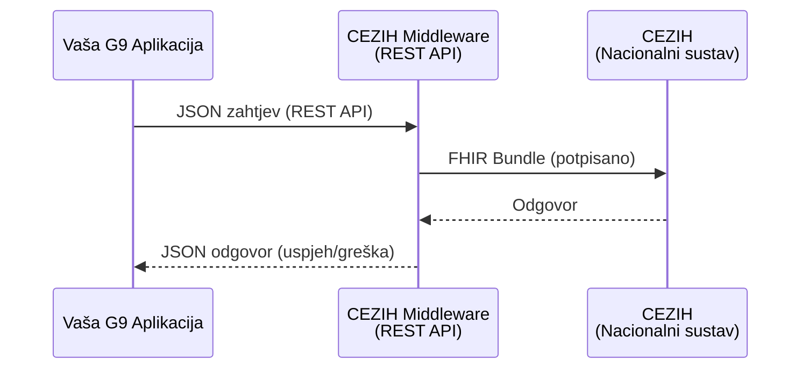
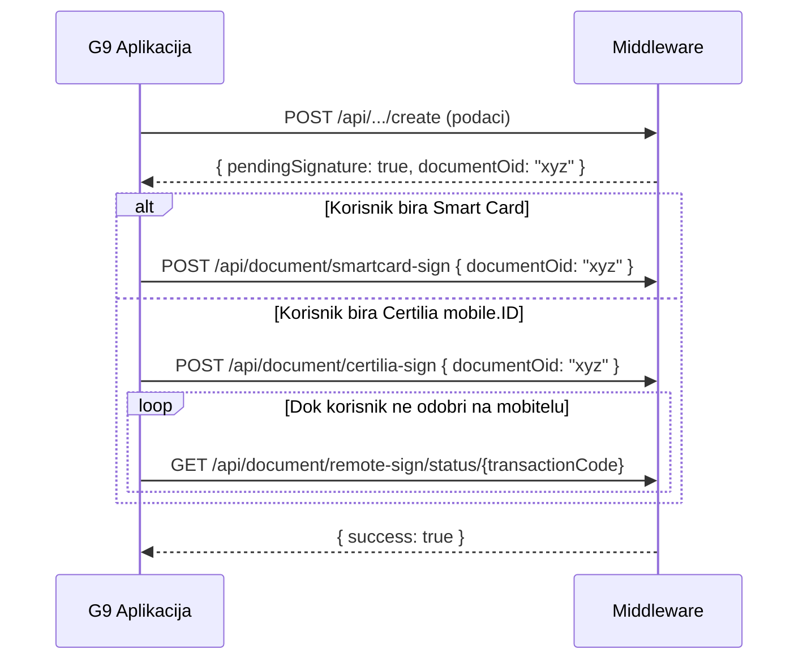

# Integracija s CEZIH FHIR Middleware-om — Specifikacija za G9 partnere
> Verzija: 1.0 · Datum: 2026-03-03  
> Kontakt: Ivan Prpić, ivan.prpic@wbs.hr

---

## 1. Pregled

CEZIH FHIR Middleware je **REST API servis** koji vaša G9 aplikacija poziva za komunikaciju s nacionalnim CEZIH sustavom. Vi šaljete jednostavne JSON zahtjeve — middleware se brine za sve ostalo (FHIR konverziju, autentikaciju, digitalni potpis, komunikaciju s CEZIH-om).



**Bazni URL:** `http://localhost:3010/api`

> [!NOTE]
> Svi endpointi primaju i vraćaju standardni JSON (`application/json`). Ne trebate poznavati FHIR format — middleware ga generira interno.

---

## 2. Autentikacija i sesije

Prije bilo kakve poslovne operacije, potrebno je uspostaviti sesiju.

### Korak 1: Pokrenite autentikaciju

Za svaku korisničku sesiju, pozovite jednu od dviju metoda:

#### Opcija A: Certilia mobile.ID (preporučeno)

Trostupanjski flow — korisnik odobrava prijavu na mobitelu.

**Korak 1 — Pokretanje:**
```
POST /api/auth/certilia/initiate
Content-Type: application/json
```

**Odgovor:**
```json
{
  "success": true,
  "sessionId": "abc123-def456",
  "step": "credentials_needed"
}
```

**Korak 2 — Slanje Certilia korisničkih podataka:**
```
POST /api/auth/certilia/login
Content-Type: application/json
```
```json
{
  "sessionId": "abc123-def456",
  "username": "korisnik@email.hr",
  "password": "lozinka"
}
```

| Polje | Tip | Obavezno | Opis |
|-------|-----|----------|------|
| `sessionId` | string | ✅ | ID sesije dobiven iz koraka 1 |
| `username` | string | ✅ | Certilia email korisnika |
| `password` | string | ✅ | Certilia lozinka korisnika |

**Korak 3 — Polling dok korisnik ne odobri na mobitelu:**
```
GET /api/auth/certilia/check?sessionId=abc123-def456
```

**Odgovor (čekanje):**
```json
{ "authenticated": false, "step": "waiting_for_mobile" }
```

**Odgovor (uspjeh):**
```json
{ "authenticated": true }
```

#### Opcija B: Smart Card (fizička kartica)

```
POST /api/auth/smartcard/interactive
```

Windows automatski prikazuje dijalog za odabir certifikata i unos PIN-a.

**Odgovor:**
```json
{ "success": true, "message": "Gateway sesija spremljena" }
```

> [!IMPORTANT]
> Zahtijeva fizički USB čitač kartica spojen na računalo gdje se pokreće middleware.

#### System Token (M2M — bez korisnika)

Za infrastrukturne operacije (TC6–TC8) koje ne zahtijevaju korisnika:

```
POST /api/auth/system-token
```

**Odgovor:**
```json
{ "success": true, "tokenPreview": "eyJhbG..." }
```

### Pregled autentikacije po test case-u

| TC | Naziv | Zahtijeva korisničku sesiju? | Zahtijeva potpis? |
|----|-------|:---:|:---:|
| TC1 | Smart Card Login | — (ovo JE prijava) | Ne |
| TC2 | Certilia Login | — (ovo JE prijava) | Ne |
| TC3 | System Token | Ne | Ne |
| TC4 | Potpis Smart Kartica | Da | — (ovo JE potpis) |
| TC5 | Potpis Certilia | Da | — (ovo JE potpis) |
| TC6–TC8 | OID, Terminologija | Ne (M2M) | Ne |
| TC9 | Registar subjekata | Ne (M2M) | Ne |
| TC10 | Pretraga pacijenta | Da | Ne |
| TC11 | Registracija stranca | Da | Da |
| TC12–TC14 | Posjete | Da | Da |
| TC15 | Dohvat slučajeva | Da | Ne |
| TC16–TC17 | Zdravstveni slučajevi | Da | Da |
| TC18–TC20 | Dokumenti (slanje/zamjena/storno) | Da | Da |
| TC21–TC22 | Dokumenti (pretraga/dohvat) | Da | Ne |

---

## 3. Digitalni potpis

TC-ovi koji zahtijevaju potpis koriste **dvostupanjski flow**:

1. **Pošaljete podatke** → middleware vam vrati `pendingSignature: true`
2. **Pozovete potpis** → ovisno o odabranoj metodi



### Endpoint za potpis Smart Karticom
```
POST /api/document/smartcard-sign
```
```json
{ "documentOid": "2.16.840.1.113883.2.7.50.2.1.722673" }
```

### Endpoint za potpis Certilia mobile.ID
```
POST /api/document/certilia-sign
```
```json
{ "documentOid": "2.16.840.1.113883.2.7.50.2.1.722673" }
```

### Polling statusa remote potpisa
```
GET /api/document/remote-sign/status/{transactionCode}
```

**Odgovor (čekanje):** `{ "status": "pending" }`  
**Odgovor (gotovo):** `{ "status": "signed", "success": true }`

---

## 4. Testni slučajevi — API pozivi i potrebni podaci

---

### TC3 — System Token (M2M Autentikacija)

```
POST /api/auth/system-token
```

**Ulazni podaci:** Nema (middleware koristi konfigurirane credentials).

**Odgovor:**
```json
{ "success": true, "tokenPreview": "eyJhbG..." }
```

---

### TC6 — Generiranje OID-a

```
POST /api/oid/generate
```

| Polje | Tip | Obavezno | Opis |
|-------|-----|----------|------|
| `quantity` | number | Ne (default: 1) | Broj OID-ova za generiranje |

**Primjer zahtjeva:**
```json
{ "quantity": 1 }
```

**Odgovor:**
```json
{
  "success": true,
  "oids": ["2.16.840.1.113883.2.7.50.2.1.722673"]
}
```

---

### TC7/TC8 — Sinkronizacija terminologije (CodeSystems + ValueSets)

```
POST /api/terminology/sync
```

**Ulazni podaci:** Nema.

**Odgovor:**
```json
{ "success": true, "codeSystems": 20, "valueSets": 20 }
```

---

### TC9 — Pretraga organizacija (Registar subjekata)

```
GET /api/registry/organizations?active=true
```

| Query parametar | Tip | Obavezno | Opis |
|----------------|-----|----------|------|
| `active` | boolean | Ne | Filtriraj samo aktivne organizacije |
| `name` | string | Ne | Pretraga po imenu |

**Odgovor:**
```json
{
  "success": true,
  "count": 5,
  "organizations": [
    {
      "id": "1473",
      "name": "Bolnica 1",
      "hzzoCode": "1234567",
      "active": true
    }
  ]
}
```

> [!WARNING]
> **Status:** Ovaj endpoint trenutno nije dostupan u CEZIH testnom okruženju (HTTP 404).

---

### TC10 — Pretraga pacijenta po MBO

```
GET /api/patient/search?mbo={mbo}
```

| Query parametar | Tip | Obavezno | Opis |
|----------------|-----|----------|------|
| `mbo` | string | ✅ | MBO broj pacijenta (9 znamenki) |
| `refresh` | boolean | Ne | `true` = forsira dohvat s CEZIH-a umjesto iz cachea |

**Primjer:**
```
GET /api/patient/search?mbo=999999423
```

**Odgovor:**
```json
{
  "success": true,
  "count": 1,
  "patients": [{
    "id": "999999423",
    "mbo": "999999423",
    "oib": "99999900419",
    "name": {
      "text": "IVAN PACPRIVATNICI42",
      "family": "PACPRIVATNICI42",
      "given": ["IVAN"]
    },
    "gender": "male",
    "birthDate": "1985-07-05",
    "active": true
  }]
}
```

---

### TC11 — Registracija stranca (PMIR)

```
POST /api/patient/register-foreigner
```

| Polje | Tip | Obavezno | Opis |
|-------|-----|----------|------|
| `firstName` | string | ✅ | Ime stranca |
| `lastName` | string | ✅ | Prezime stranca |
| `birthDate` | string (YYYY-MM-DD) | ✅ | Datum rođenja |
| `gender` | string | ✅ | `male` / `female` / `other` / `unknown` |
| `passportNumber` | string | ✅ | Broj putovnice ili osobne EU isprave |
| `nationality` | string | ✅ | ISO 3166-1 alpha-2 kod države (npr. `DE`, `IT`, `US`) |

**Primjer zahtjeva:**
```json
{
  "firstName": "John",
  "lastName": "Doe",
  "birthDate": "1990-05-15",
  "gender": "male",
  "passportNumber": "AB123456",
  "nationality": "US"
}
```

**Odgovor:**
```json
{ "success": true, "mbo": "F12345678" }
```

> [!WARNING]
> **Status:** CEZIH PMIR endpoint trenutno nije dostupan. Middleware dodijeljuje privremeni MBO.

---

### TC12 — Kreiranje posjete (Encounter Create)

```
POST /api/visit/create
```

| Polje | Tip | Obavezno | Opis | Dozvoljene vrijednosti |
|-------|-----|----------|------|-----------------------|
| `patientMbo` | string | ✅ | MBO pacijenta | 9 znamenki |
| `admissionType` | string | ✅ | Način prijema | `AMB` (ambulantno), `EMER` (hitni), `IMP` (stacionarno), `OTHER` |
| `visitType` | string | ✅ | Vrsta posjete | `1` (pacijent prisutan), `2` (pacijent odsutan) |
| `visitTypeSkzz` | string | Ne | Tip SKZZ posjete | `1` (redovna SKZZ), `2` (posjeta SKZZ) |
| `costParticipation` | string | Ne | Sudjelovanje u troškovima | `N` (ne), `D` (da) |
| `exemptionCode` | string | Ne | Šifra oslobođenja | Kod iz CEZIH šifrarnika (npr. `55`) |
| `priority` | string | Ne | Prioritet | `R` (routine), `EM` (emergency) |

**Primjer zahtjeva:**
```json
{
  "patientMbo": "999999423",
  "admissionType": "AMB",
  "visitType": "1",
  "visitTypeSkzz": "2",
  "costParticipation": "N",
  "exemptionCode": "55",
  "priority": "R"
}
```

**Odgovor (potpis potreban):**
```json
{
  "success": true,
  "pendingSignature": true,
  "visitId": "a1b2c3d4-...",
  "documentOid": "a1b2c3d4-..."
}
```

Nakon potpisa:
```json
{
  "success": true,
  "visitId": "a1b2c3d4-...",
  "cezihId": "1234567",
  "result": { "responseCode": "ok" }
}
```

> [!WARNING]
> **Status:** Blokirano u CEZIH testnom okruženju (Organization resolution greška). Middleware kod je ispravan.

---

### TC13 — Ažuriranje posjete (Encounter Update)

```
PUT /api/visit/{visitId}
```

| Polje | Tip | Obavezno | Opis |
|-------|-----|----------|------|
| `patientMbo` | string | ✅ | MBO pacijenta |
| `diagnosisCode` | string | Ne | MKB-10 kod dijagnoze (npr. `M17.1`) |
| `diagnosisDisplay` | string | Ne | Naziv dijagnoze |

**URL parametar:** `visitId` — lokalni UUID posjete iz TC12.

**Primjer zahtjeva:**
```json
{
  "patientMbo": "999999423",
  "diagnosisCode": "M17.1",
  "diagnosisDisplay": "Primarna gonartroza obostrana"
}
```

---

### TC14 — Zatvaranje posjete (Encounter Close)

```
POST /api/visit/{visitId}/close
```

| Polje | Tip | Obavezno | Opis |
|-------|-----|----------|------|
| `patientMbo` | string | ✅ | MBO pacijenta |
| `endDate` | string (ISO 8601) | Ne | Datum/vrijeme zatvaranja (default: sada) |

**Primjer zahtjeva:**
```json
{
  "patientMbo": "999999423",
  "endDate": "2026-03-01T14:00:00.000Z"
}
```

---

### TC15 — Dohvat zdravstvenih slučajeva (Condition)

```
GET /api/case/patient/{mbo}
```

| Query parametar | Tip | Obavezno | Opis |
|----------------|-----|----------|------|
| `refresh` | boolean | Ne | `true` = forsira dohvat s CEZIH-a |

**Primjer:**
```
GET /api/case/patient/999999423?refresh=true
```

**Odgovor:**
```json
{
  "success": true,
  "count": 1,
  "cases": [{
    "id": "b52327bb-...",
    "patientMbo": "999999423",
    "title": "Fizikalna terapija",
    "status": "active",
    "diagnosisCode": "M17.1",
    "diagnosisDisplay": "Primarna gonartroza",
    "cezihIdentifier": "cmm896oft01mf5c85a7nq7ljm"
  }]
}
```

---

### TC16 — Kreiranje zdravstvenog slučaja (Condition Create)

```
POST /api/case/create
```

| Polje | Tip | Obavezno | Opis |
|-------|-----|----------|------|
| `patientMbo` | string | ✅ | MBO pacijenta |
| `diagnosisCode` | string | ✅ | MKB-10 kod (npr. `J06.9`) |
| `diagnosisDisplay` | string | ✅ | Naziv dijagnoze (npr. `Akutna infekcija gornjih dišnih puteva`) |
| `title` | string | Ne | Naslov/opis slučaja |

**Primjer zahtjeva:**
```json
{
  "patientMbo": "999999423",
  "diagnosisCode": "J06.9",
  "diagnosisDisplay": "Akutna infekcija gornjih dišnih puteva",
  "title": "Respiratorna infekcija"
}
```

**Odgovor:**
```json
{
  "success": true,
  "result": {
    "responseCode": "ok",
    "conditionId": "1220861",
    "cezihIdentifier": "cmm896oft01mf5c85a7nq7ljm"
  }
}
```

> [!TIP]
> Sačuvajte `cezihIdentifier` — potreban je za svaku buduću izmjenu ovog slučaja (TC17).

---

### TC17 — Ažuriranje zdravstvenog slučaja (Condition Update)

```
PUT /api/case/{caseId}
```

| Polje | Tip | Obavezno | Opis |
|-------|-----|----------|------|
| `patientMbo` | string | ✅ | MBO pacijenta |
| `diagnosisCode` | string | ✅ | MKB-10 kod |
| `diagnosisDisplay` | string | ✅ | Naziv dijagnoze |
| `cezihIdentifier` | string | ✅ | Globalni identifikator slučaja (iz TC16) |

**URL parametar:** `caseId` — lokalni ID slučaja.

**Primjer zahtjeva:**
```json
{
  "patientMbo": "999999423",
  "diagnosisCode": "J06.9",
  "diagnosisDisplay": "Akutna infekcija - ažurirano",
  "cezihIdentifier": "cmm896oft01mf5c85a7nq7ljm"
}
```

---

### TC18 — Slanje dokumenta (ITI-65)

Dvostupanjski flow — priprema + potpis.

#### Korak 1: Priprema dokumenta
```
POST /api/document/send
```

| Polje | Tip | Obavezno | Opis | Primjer |
|-------|-----|----------|------|---------|
| `patientMbo` | string | ✅ | MBO pacijenta | `"999999423"` |
| `type` | string | ✅ | Tip dokumenta | `"ambulatory-report"` |
| `title` | string | ✅ | Naslov nalaza | `"Ambulantni nalaz"` |
| `diagnosisCode` | string | ✅ | MKB-10 kod | `"J06.9"` |
| `diagnosisDisplay` | string | Ne | Naziv dijagnoze | `"Akutna infekcija..."` |
| `anamnesis` | string | Ne | Anamneza | Tekst |
| `status` | string | Ne | Objektivni nalaz/status | Tekst |
| `therapy` | string | Ne | Terapija | Tekst |
| `visitId` | string | Ne | ID lokalne posjete (ako postoji) | UUID |

**Dozvoljene vrijednosti za `type`:**

| Vrijednost | Opis | CEZIH kod |
|------------|------|-----------|
| `ambulatory-report` | Izvješće nakon pregleda u ambulanti | `011` |
| `discharge-letter` | Otpusno pismo | `003` |
| `specialist-report` | Specijalističko izvješće | `012` |
| `lab-report` | Laboratorijski nalaz | `004` |

**Primjer zahtjeva:**
```json
{
  "patientMbo": "999999423",
  "type": "ambulatory-report",
  "title": "Ambulantni nalaz",
  "diagnosisCode": "J06.9",
  "diagnosisDisplay": "Akutna infekcija gornjih dišnih puteva",
  "anamnesis": "Pacijent se žali na grlobolju i povišenu temperaturu od 3 dana.",
  "status": "Ždrijelo hiperemično. Tonzile uvećane. Tjelesna temperatura 37.8°C.",
  "therapy": "Ibuprofen 400mg 3x1. Mirovanje. Kontrola za 5 dana."
}
```

**Odgovor:**
```json
{
  "success": true,
  "pendingSignature": true,
  "documentOid": "2.16.840.1.113883.2.7.50.2.1.722673"
}
```

#### Korak 2: Potpis i slanje

Pozovite jednu od metoda potpisa (vidi sekciju 3):
```
POST /api/document/smartcard-sign    { "documentOid": "..." }
POST /api/document/certilia-sign     { "documentOid": "..." }
```

**Konačni odgovor:**
```json
{
  "success": true,
  "result": {
    "status": "registered",
    "documentOid": "2.16.840.1.113883.2.7.50.2.1.722673"
  }
}
```

---

### TC19 — Zamjena dokumenta (Replace)

```
POST /api/document/replace
```

| Polje | Tip | Obavezno | Opis |
|-------|-----|----------|------|
| `originalDocumentOid` | string | ✅ | OID originalnog dokumenta koji se zamjenjuje |
| `patientMbo` | string | ✅ | MBO pacijenta |
| `type` | string | ✅ | Tip dokumenta (isti kao TC18) |
| `title` | string | ✅ | Novi naslov |
| `diagnosisCode` | string | ✅ | MKB-10 kod |
| `anamnesis` | string | Ne | Nova anamneza |
| `status` | string | Ne | Novi nalaz |
| `therapy` | string | Ne | Nova terapija |

**Primjer zahtjeva:**
```json
{
  "originalDocumentOid": "2.16.840.1.113883.2.7.50.2.1.722673",
  "patientMbo": "999999423",
  "type": "ambulatory-report",
  "title": "Ispravljeni ambulantni nalaz",
  "diagnosisCode": "J06.9",
  "anamnesis": "...",
  "status": "...",
  "therapy": "..."
}
```

---

### TC20 — Storno dokumenta (Cancel)

```
POST /api/document/cancel
```

| Polje | Tip | Obavezno | Opis |
|-------|-----|----------|------|
| `documentOid` | string | ✅ | OID dokumenta za storniranje |

**Primjer zahtjeva:**
```json
{
  "documentOid": "2.16.840.1.113883.2.7.50.2.1.722673"
}
```

**Odgovor:**
```json
{ "success": true, "result": { "status": "cancelled" } }
```

---

### TC21 — Pretraga dokumenata

```
GET /api/document/search
```

| Query parametar | Tip | Obavezno | Opis |
|----------------|-----|----------|------|
| `patientMbo` | string | ✅ | MBO pacijenta |
| `dateFrom` | string (YYYY-MM-DD) | Ne | Početni datum |
| `dateTo` | string (YYYY-MM-DD) | Ne | Krajnji datum |
| `type` | string | Ne | Tip dokumenta |

**Primjer:**
```
GET /api/document/search?patientMbo=999999423
```

**Odgovor:**
```json
{
  "success": true,
  "count": 3,
  "documents": [
    {
      "documentOid": "2.16.840.1.113883.2.7.50.2.1.722673",
      "title": "Ambulantni nalaz",
      "type": "ambulatory-report",
      "date": "2026-03-01",
      "status": "current",
      "patientMbo": "999999423",
      "source": "local"
    }
  ]
}
```

> `source` može biti `"local"` (iz middleware baze) ili `"cezih"` (s CEZIH servera).

---

### TC22 — Dohvat dokumenta

```
GET /api/document/retrieve
```

| Query parametar | Tip | Obavezno | Opis |
|----------------|-----|----------|------|
| `url` | string | ✅ | URL ili OID dokumenta |

**Primjer:**
```
GET /api/document/retrieve?url=urn:oid:2.16.840.1.113883.2.7.50.2.1.722673
```

**Odgovor:**
```json
{
  "success": true,
  "document": {
    "content": "...",
    "contentType": "application/fhir+json",
    "title": "Ambulantni nalaz",
    "sections": {
      "anamnesis": "...",
      "status": "...",
      "therapy": "..."
    }
  }
}
```

---

## 5. Status provjera sesije

Za provjeru je li korisnik trenutno prijavljen:

```
GET /api/auth/status
```

**Odgovor:**
```json
{
  "authenticated": true,
  "method": "certilia",
  "hasGatewaySession": true,
  "hasSystemToken": true
}
```

---

## 6. Tipovi podataka — Referenca

### Formati

| Tip | Format | Primjer |
|-----|--------|---------|
| MBO | 9 numeričkih znamenki | `999999423` |
| OIB | 11 numeričkih znamenki | `30160453873` |
| MKB-10 kod | Alfanumerički, s točkom | `J06.9`, `M17.1` |
| Datum | ISO 8601 (YYYY-MM-DD) | `2026-03-01` |
| Datum-vrijeme | ISO 8601 s timezone | `2026-03-01T14:00:00.000Z` |
| OID | Numerički, s točkama | `2.16.840.1.113883.2.7.50.2.1.722673` |
| UUID | RFC 4122 | `a1b2c3d4-e5f6-7890-abcd-ef1234567890` |

### Admission Type (admissionType)

| Vrijednost | Opis |
|------------|------|
| `AMB` | Ambulantno (redovni pregled) |
| `EMER` | Hitni prijem |
| `IMP` | Stacionarni prijem |
| `OTHER` | Ostalo |

### Gender

| Vrijednost | Opis |
|------------|------|
| `male` | Muški |
| `female` | Ženski |
| `other` | Ostalo |
| `unknown` | Nepoznato |

---

## 7. Greške

Middleware vraća standardizirani format grešaka:

```json
{
  "success": false,
  "error": "Opis greške na hrvatskom jeziku"
}
```

HTTP Status kodovi:

| Kod | Značenje |
|-----|---------|
| `200` | Uspjeh |
| `400` | Neispravni ulazni podaci (validacijska greška) |
| `401` | Sesija nije aktivna — potrebna ponovna prijava |
| `408` | Timeout (npr. korisnik nije odobrio potpis na mobitelu) |
| `500` | Interna greška ili CEZIH greška |

---

## 8. Tipični workflow — Kompletna posjeta

Ovo je preporučeni redoslijed poziva za kompletnu posjetu:

```
1. POST /api/auth/certilia/initiate          → Prijava (jednom dnevno)
2. POST /api/auth/certilia/login             → Kredencijali
3. GET  /api/auth/certilia/check             → Čekaj odobrenje
4. GET  /api/patient/search?mbo=...          → Pronađi pacijenta (TC10)
5. POST /api/visit/create                    → Otvori posjetu (TC12)
6. POST /api/document/smartcard-sign         → Potpiši posjetu
7. POST /api/case/create                     → Kreiraj slučaj (TC16)
8. POST /api/document/send                   → Pripremi dokument (TC18)
9. POST /api/document/smartcard-sign         → Potpiši dokument
10. POST /api/visit/{id}/close               → Zatvori posjetu (TC14)
11. POST /api/document/smartcard-sign        → Potpiši zatvaranje
```

> [!TIP]
> Koraci 5–11 mogu se izvesti u bilo kojem redoslijedu osim što slučaj (korak 7) mora postojati prije nego što ga referencira dokument, i posjeta mora biti otvorena (korak 5) prije nego što se zatvori (korak 10).

---

## 9. Aktualni status testnih slučajeva

*Posljednje ažuriranje: 2026-03-03*

| TC | Naziv | Status | Napomena |
|----|-------|--------|----------|
| TC1–TC5 | Autentikacija i potpis | ✅ Spremno | |
| TC6–TC8 | OID, terminologija | ✅ Spremno | |
| TC9 | Registar subjekata | ⚠️ Čeka CEZIH | Endpoint nedostupan |
| TC10 | Pretraga pacijenta | ✅ Spremno | |
| TC11 | Registracija stranca | ⚠️ Čeka CEZIH | Endpoint nedostupan |
| TC12–TC14 | Posjete | ⚠️ Čeka CEZIH | Organization registracija u tijeku |
| TC15 | Dohvat slučajeva | ✅ Spremno | |
| TC16–TC17 | Zdravstveni slučajevi | ✅ Spremno | Verificirano na CEZIH-u |
| TC18–TC20 | Dokumenti (CUD) | ⚠️ Čeka CEZIH | Organization registracija u tijeku |
| TC21–TC22 | Dokumenti (pretraga/dohvat) | ✅ Spremno | |

**13 od 22** testna slučaja su potpuno funkcionalni. Preostalih 9 je blokirano isključivo zbog konfiguracijskih problema u CEZIH testnom okruženju, a ne zbog middleware koda.

---

*Dokument generiran: 2026-03-03 · Za tehničke informacije kontaktirajte: ivan.prpic@wbs.hr*
