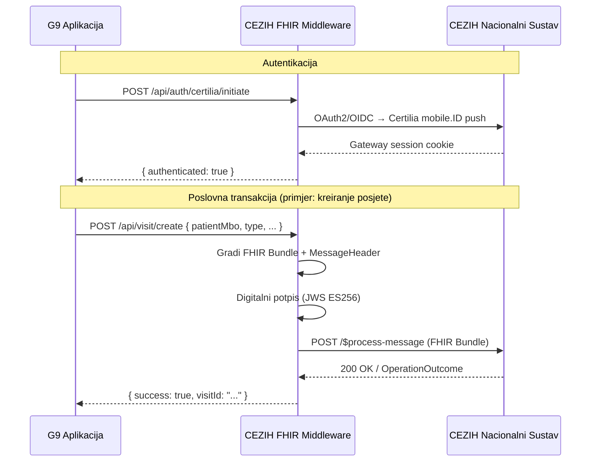
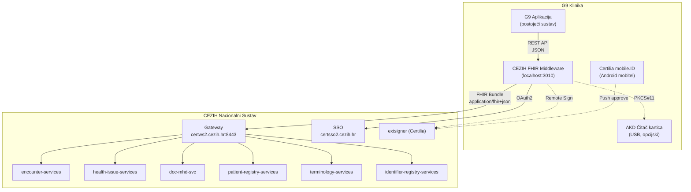
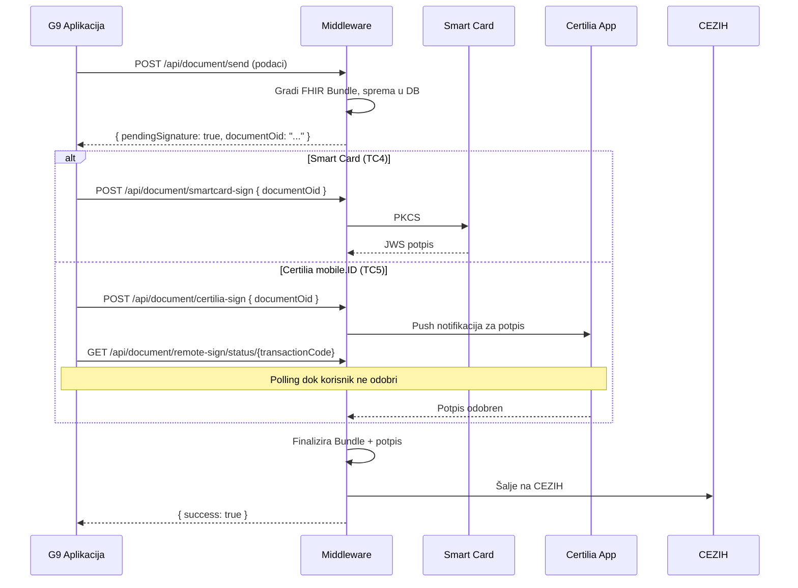

# CEZIH FHIR Middleware — Tehnički vodič za integraciju
> Verzija: 1.0 · Datum: 2026-03-03  
> Middleware: `cezih_fhir` (Node.js/Express/TypeScript)  
> Kontakt: Ivan Prpić, ivan.prpic@wbs.hr

---

## 1. Što je ovaj middleware?

CEZIH FHIR Middleware je **samostalan REST API servis** koji služi kao posrednik između G9 aplikacije i nacionalnog CEZIH FHIR sustava. G9 aplikacija šalje jednostavne JSON zahtjeve na middleware, a middleware:

1. **Gradi** ispravne FHIR Bundle-ove prema CEZIH profilima (StructureDefinitions)
2. **Potpisuje** poruke digitalno (JWS, ES256) koristeći AKD Certilia karticu ili Certilia mobile.ID
3. **Šalje** poruke na ispravne CEZIH mikroservise uz pravilnu autentikaciju
4. **Vraća** rezultat G9 aplikaciji i čuva lokalni audit log



### Ključni principi

| Princip | Opis |
|---------|------|
| **G9 ne gradi FHIR** | G9 šalje jednostavne JSON objekte. Middleware gradi FHIR Bundle-ove. |
| **Middleware upravlja sesijama** | Gateway cookie, system token — middleware ih dohvaća i obnavlja. |
| **Potpis je na middleware-u** | Smart card (PKCS#11) ili Certilia mobile.ID — middleware orkestrira. |
| **Lokalni cache** | Pacijenti, terminologija, posjete — keširani u SQLite za brzi pristup. |

---

## 2. Arhitektura sustava



### Komponente Middleware-a

| Servis | Datoteka | Odgovornost |
|--------|----------|-------------|
| `AuthService` | `auth.service.ts` | Gateway sesije, system token (M2M), OIDC flow |
| `CertiliaAuthClient` | `certilia-auth.service.ts` | Certilia mobile.ID login flow |
| `VisitService` | `visit.service.ts` | Encounter FHIR Messaging (TC12/13/14) |
| `CaseService` | `case.service.ts` | Health Issue / Condition (TC16/17) |
| `ClinicalDocumentService` | `clinical-document.service.ts` | MHD ITI-65 Bundle (TC18/19/20/21/22) |
| `PatientService` | `patient.service.ts` | PDQm pretraga i PMIR registracija (TC10/11) |
| `SignatureService` | `signature.service.ts` | JWS potpis orkestracija |
| `Pkcs11Service` | `pkcs11.service.ts` | PKCS#11 smart card potpis (lokalni) |
| `RemoteSignService` | `remote-sign.service.ts` | Certilia remote signing |
| `OidService` | `oid.service.ts` | OID generiranje (ITI-98) |
| `TerminologyService` | `terminology.service.ts` | CodeSystem/ValueSet sync (ITI-96/95) |
| `RegistryService` | `registry.service.ts` | Organization/Practitioner pretraga (mCSD) |

---

## 3. Pregled 22 testna slučaja

### Legenda

| Simbol | Značenje |
|--------|----------|
| **S** | System Authentication (client_credentials) |
| **U** | User Authentication (Gateway sesija — Smart Card ili Certilia) |
| **P** | Digitalni potpis (JWS) obvezan |
| ✅ | Prolazi u testnom okruženju |
| ⚠️ | Blokirano — vanjski razlog (CEZIH okruženje) |
| ⏭️ | Preskočeno — čeka infrastrukturu |

### Matrica

| TC | Naziv | IHE Profil | Auth | Middleware API | Status |
|----|-------|-----------|------|----------------|--------|
| **1** | Smart Card Login | — | U | `POST /api/auth/smartcard/interactive` | ✅ |
| **2** | Certilia mobile.ID Login | — | U | `POST /api/auth/certilia/initiate` → poll | ✅ |
| **3** | System Token (M2M) | OAuth2 | S | `POST /api/auth/system-token` | ✅ |
| **4** | Potpis Smart Kartica | — | U+P | `POST /api/sign/smartcard` | ✅ |
| **5** | Potpis Certilia Cloud | — | U+P | `POST /api/sign/certilia` | ✅ |
| **6** | OID Generiranje | ITI-98 | S | `POST /api/oid/generate` | ✅ |
| **7** | Sync CodeSystems | ITI-96 | S | `POST /api/terminology/sync` | ✅ |
| **8** | Sync ValueSets | ITI-95 | S | `POST /api/terminology/sync` | ✅ |
| **9** | Registar subjekata (mCSD) | ITI-90 | S | `GET /api/registry/organizations` | ⚠️ |
| **10** | Pretraga pacijenta (MBO) | ITI-78 (PDQm) | U | `GET /api/patient/search?mbo=` | ✅ |
| **11** | Registracija stranca | PMIR | U+P | `POST /api/patient/register-foreigner` | ⚠️ |
| **12** | Kreiranje posjete | FHIR Messaging | U+P | `POST /api/visit/create` | ⚠️ |
| **13** | Ažuriranje posjete | FHIR Messaging | U+P | `PUT /api/visit/{id}` | ⚠️ |
| **14** | Zatvaranje posjete | FHIR Messaging | U+P | `POST /api/visit/{id}/close` | ⚠️ |
| **15** | Dohvat slučajeva | QEDm | U | `GET /api/case/patient/{mbo}` | ✅ |
| **16** | Kreiranje slučaja | FHIR Messaging | U+P | `POST /api/case/create` | ✅ |
| **17** | Ažuriranje slučaja | FHIR Messaging | U+P | `PUT /api/case/{id}` | ✅ |
| **18** | Slanje dokumenta | ITI-65 (MHD) | U+P | `POST /api/document/send` | ⚠️ |
| **19** | Zamjena dokumenta | ITI-65 (MHD) | U+P | `POST /api/document/replace` | ⚠️ |
| **20** | Storno dokumenta | ITI-65 (MHD) | U+P | `POST /api/document/cancel` | ⚠️ |
| **21** | Pretraga dokumenata | ITI-67 | U | `GET /api/document/search` | ✅ |
| **22** | Dohvat dokumenta | ITI-68 | U | `GET /api/document/retrieve` | ✅ |

> [!WARNING]
> **Aktualni bloker (2026-03-03):** TC9, TC11, TC12-14, TC18-20 su blokirani jer CEZIH testno okruženje ne može resolvati Organization resurs. Middleware kod je ispravan i validiran — čekamo registraciju organizacije od strane CEZIH tima.

---

## 4. Detalji po grupama

### 4.1 Autentikacija i Autorizacija (TC1–TC5)

Middleware podržava **tri tipa autentikacije**:

#### System Authentication (M2M) — TC3
Koristi se za infrastrukturne operacije (OID, terminologija) koje ne zahtijevaju korisnika.

```
POST /api/auth/system-token
→ { success: true, tokenPreview: "eyJhbG..." }
```

Middleware interno poziva:
```
POST https://certsso2.cezih.hr/auth/realms/CEZIH/protocol/openid-connect/token
Content-Type: application/x-www-form-urlencoded
grant_type=client_credentials&client_id={CLIENT_ID}&client_secret={CLIENT_SECRET}
```

#### Smart Card Login — TC1
Koristi AKD Certilia pametnu karticu i USB čitač.

```
POST /api/auth/smartcard/interactive
→ { success: true, message: "Gateway sesija spremljena" }
```

Windows prikazuje nativni dijalog za odabir certifikata i unos PIN-a. Middleware interno pohranjuje `mod_auth_openidc_session` cookie.

#### Certilia mobile.ID Login — TC2
Koristi Certilia aplikaciju na Android mobitelu.

```
POST /api/auth/certilia/initiate
→ { success: true, sessionId: "abc123", step: "credentials_needed" }

POST /api/auth/certilia/login
{ sessionId: "abc123", username: "email@primjer.hr", password: "lozinka" }
→ { success: true, step: "waiting_for_mobile" }

GET /api/auth/certilia/check?sessionId=abc123
→ { authenticated: true }  // nakon odobrenja na mobitelu
```

#### Digitalni potpis — TC4 i TC5

Middleware koristi **deferred signing** arhitekturu u dva koraka:

1. **Priprema** — bundle se gradi i sprema u bazu (status: `pending_signature`)
2. **Potpis** — korisnik bira metodu, middleware potpisuje i šalje



> [!IMPORTANT]
> **Iden vs Sign token:** Koristimo **Iden** token (Authentication) za potpis, ne Sign token. Sign token ima `CKA_ALWAYS_AUTHENTICATE=true` što blokira headless signing u Certilia middleware-u. Iden token koristi ES256 (ECDSA P-256) i radi bez problema.

---

### 4.2 Infrastruktura (TC6–TC9)

#### TC6 — OID Generiranje (ITI-98)

CEZIH dodjeljuje globalno jedinstvene OID-ove za dokumente.

```
POST /api/oid/generate
{ "quantity": 1 }
→ { success: true, oids: ["2.16.840.1.113883.2.7.50.2.1.722673"] }
```

CEZIH endpoint: `POST /identifier-registry-services/api/v1/oid/generateOIDBatch`  
Auth: System token (M2M), port 9443

#### TC7/TC8 — Terminologija (ITI-96/ITI-95)

Sinkronizira CodeSystem-e i ValueSet-ove s CEZIH terminologijskim servisom. Podaci se pohranjuju lokalno u SQLite.

```
POST /api/terminology/sync
→ { success: true, codeSystems: 20, valueSets: 20 }
```

Middleware interno poziva:
- `GET /terminology-services/api/v1/CodeSystem` (ITI-96)
- `GET /terminology-services/api/v1/ValueSet` (ITI-95)

#### TC9 — Registar subjekata (mCSD ITI-90)

Pretraga Organization/Practitioner resursa.

```
GET /api/registry/organizations?active=true
→ { success: true, organizations: [...] }
```

> [!WARNING]
> **Status:** CEZIH mCSD endpoint nije dostupan u testnom okruženju (HTTP 404 na 30+ testiranih putanja). Middleware implementacija je spremna — čeka ispravnu putanju od CEZIH-a.

---

### 4.3 Upravljanje pacijentima (TC10–TC11)

#### TC10 — Pretraga pacijenta po MBO (PDQm ITI-78)

```
GET /api/patient/search?mbo=999999423
→ {
    success: true,
    patients: [{
        mbo: "999999423",
        oib: "99999900419",
        name: { family: "PACPRIVATNICI42", given: ["IVAN"] },
        gender: "male",
        birthDate: "1985-07-05"
    }]
  }
```

CEZIH endpoint: `GET /patient-registry-services/api/v1/Patient`  
Auth: Gateway sesija (cookie)

#### TC11 — Registracija stranca (PMIR ITI-93)

```
POST /api/patient/register-foreigner
{
    "firstName": "John",
    "lastName": "Doe",
    "birthDate": "1990-05-15",
    "gender": "male",
    "passportNumber": "AB123456",
    "nationality": "US"
}
→ { success: true, mbo: "F12345678" }
```

CEZIH endpoint: `POST /patient-registry-services/api/v1/iti93`  
Auth: Gateway sesija + potpis

> [!WARNING]
> **Status:** Endpoint trenutno vraća 404. Middleware gradi PMIR bundle ali koristi privremeni mock MBO dok se ne potvrdi dostupnost endpointa.

---

### 4.4 Posjete — Encounter Management (TC12–TC14)

CEZIH koristi **FHIR Messaging** (`$process-message`) za upravljanje posjetama. Svaka poruka je Bundle tipa `message` s `MessageHeader` + `Encounter` resursom.

#### CEZIH FHIR profili za posjete

| Akcija | TC | Event Code | Bundle Profile |
|--------|------|------------|----------------|
| Kreiranje | TC12 | `1.1` | `hr-create-encounter-message` |
| Ažuriranje | TC13 | `1.2` | `hr-update-encounter-message` |
| Zatvaranje | TC14 | `1.3` | `hr-close-encounter-message` |

**Event CodeSystem:** `http://ent.hr/fhir/CodeSystem/ehe-message-types`  
**MessageHeader profil:** `hr-encounter-management-message-header`

#### TC12 — Kreiranje posjete

```
POST /api/visit/create
{
    "patientMbo": "999999423",
    "admissionType": "AMB",
    "visitType": "1",
    "visitTypeSkzz": "2",
    "costParticipation": "N",
    "exemptionCode": "55",
    "priority": "R"
}
→ { success: true, visitId: "...", result: { ... } }
```

**Što middleware interno radi:**
1. Generira UUID-ove za Bundle, MessageHeader i Encounter
2. Gradi `MessageHeader` s event kodom `1.1`, `author` (HZJZ ID), `sender` (HZZO šifra)
3. Gradi `Encounter` resurs s CEZIH-specifičnim extensionima (troškovi, sudjelovanje)
4. Mapira `admissionType` (AMB→1, EMER→2, IMP→3) na CEZIH kodove
5. Potpisuje bundle (JWS ES256) s Iden tokenom
6. Šalje na `POST /encounter-services/api/v1/$process-message`

> **Puni JSON primjer:** Vidi [Prilog A: Encounter Create Bundle](#prilog-a-encounter-create-bundle-tc12)

#### TC13 — Ažuriranje posjete

```
PUT /api/visit/{visitId}
{
    "patientMbo": "999999423",
    "diagnosisCode": "M17.1",
    "diagnosisDisplay": "Gonarthrosis"
}
```

Event kod `1.2`. MessageHeader referencira postojeći Encounter iz TC12.

#### TC14 — Zatvaranje posjete

```
POST /api/visit/{visitId}/close
{
    "patientMbo": "999999423",
    "endDate": "2026-03-01T14:00:00.000Z"
}
```

Event kod `1.3`. Encounter status se mijenja u `finished`.

#### Encounter Class kodovi (CEZIH specifični)

| Tip | CEZIH Kod | Display |
|-----|-----------|---------|
| Ambulantno | `1` | Redovni |
| Hitni | `2` | Hitni |
| Stacionarni | `3` | Stacionarni |
| Ostalo | `6` | Ostalo |
| Interna uputnica | `9` | Interna uputnica |

**CodeSystem:** `http://fhir.cezih.hr/specifikacije/CodeSystem/nacin-prijema`

---

### 4.5 Zdravstveni slučajevi — Condition (TC15–TC17)

#### TC15 — Dohvat slučajeva (QEDm)

```
GET /api/case/patient/{mbo}?refresh=true
→ {
    success: true,
    cases: [{
        id: "b52327bb-...",
        patientMbo: "999999423",
        title: "Fizikalna terapija",
        status: "active",
        diagnosisCode: "M17.1",
        cezihIdentifier: "cmm896oft01mf5c85a7nq7ljm"
    }]
  }
```

CEZIH endpoint: `GET /ihe-qedm-services/api/v1/Condition`

#### TC16 — Kreiranje slučaja (Condition)

```
POST /api/case/create
{
    "patientMbo": "999999423",
    "diagnosisCode": "J06.9",
    "diagnosisDisplay": "Akutna infekcija gornjih dišnih puteva",
    "title": "Respiratorna infekcija"
}
→ {
    success: true,
    result: {
        responseCode: "ok",
        conditionId: "1220861",
        cezihIdentifier: "cmm896oft01mf5c85a7nq7ljm"
    }
  }
```

**CEZIH profili za health issue:**

| Akcija | Event Code | Bundle Profile |
|--------|------------|----------------|
| Kreiranje | `2.1` | `hr-create-health-issue-message` |
| Ažuriranje podataka | `2.6` | `hr-update-health-issue-data-message` |
| Ponavljanje | `2.2` | `hr-create-health-issue-recurrence-message` |
| Remisija | `2.3` | `hr-health-issue-remission-message` |
| Zaključivanje | `2.4` | `hr-health-issue-resolve-message` |
| Relaps | `2.5` | `hr-health-issue-relapse-message` |
| Brisanje | `2.7` | `hr-delete-health-issue-message` |

**Kritični detalji za potpis (DIGSIG-1 constraint):**
- `Bundle.signature` mora biti **objekt**, ne array
- `signature.who` mora koristiti **HZJZ ID** (ne OIB!)
- `sigFormat` se **ne smije** slati (maxCardinality: 0)
- `MessageHeader.author` **mora** postojati
- UUID-ovi moraju biti čisti (bez prefiksa poput `condition-`)

#### TC17 — Ažuriranje slučaja

```
PUT /api/case/{caseId}
{
    "patientMbo": "999999423",
    "diagnosisCode": "J06.9",
    "diagnosisDisplay": "Akutna infekcija gornjih dišnih puteva - ažurirano",
    "cezihIdentifier": "cmm896oft01mf5c85a7nq7ljm"
}
```

Event kod `2.6`. Koristi globalni `cezihIdentifier` dobiven iz TC16.

---

### 4.6 Klinička dokumentacija — MHD (TC18–TC22)

#### TC18 — Slanje dokumenta (ITI-65)

Najsloženiji test case. Middleware gradi **MHD Bundle** (transaction) s tri entry-ja:

1. **SubmissionSet** (List) — metapodaci o submisiji
2. **DocumentReference** — metapodaci o dokumentu
3. **Binary** — sam dokument (base64 FHIR Document Bundle)

```
POST /api/document/send
{
    "patientMbo": "999999423",
    "type": "ambulatory-report",
    "title": "Ambulantni nalaz",
    "diagnosisCode": "J06.9",
    "anamnesis": "Pacijent se žali na...",
    "status": "Objektivni nalaz...",
    "therapy": "Terapija..."
}
→ { success: true, pendingSignature: true, documentOid: "..." }
```

Nakon toga G9 poziva metodu potpisa:
```
POST /api/document/smartcard-sign   { documentOid: "..." }
  ILI
POST /api/document/certilia-sign    { documentOid: "..." }
```

**CEZIH MHD profili:**

| Resurs | Profil | Napomena |
|--------|--------|----------|
| Bundle | `HRMinimalProvideDocumentBundle` | Closed slicing! |
| DocumentReference | `HR.MinimalDocumentReference` | ⚠️ Pozor: **točka** u imenu! |
| SubmissionSet (List) | `HRMinimalSubmissionSet` | 2 identifikatora + ihe-sourceId |

**Entry redoslijed** (obvezan jer je slicing CLOSED):
1. SubmissionSet (List)
2. DocumentReference
3. Binary

**Content-Type**: Mora biti `application/fhir+json` (ne `application/json`!)

CEZIH endpoint: `POST /doc-mhd-svc/api/v1/iti-65-service`

> **Puni JSON primjer:** Vidi [Prilog B: MHD Document Bundle](#prilog-b-mhd-document-bundle-tc18)

#### TC19 — Zamjena dokumenta (Replace)

```
POST /api/document/replace
{
    "originalDocumentOid": "2.16.840.1.113883.2.7.50.2.1.XXXXX",
    "patientMbo": "999999423",
    "type": "ambulatory-report",
    "title": "Ispravljeni nalaz",
    ...ostali podaci...
}
```

Koristi `DocumentReference.relatesTo[].code = "replaces"` s referencom na originalni dokument.

#### TC20 — Storno dokumenta (Cancel)

```
POST /api/document/cancel
{ "documentOid": "2.16.840.1.113883.2.7.50.2.1.XXXXX" }
```

Postavlja `DocumentReference.status = "entered-in-error"`.

#### TC21 — Pretraga dokumenata (ITI-67)

```
GET /api/document/search?patientMbo=999999423
→ { success: true, documents: [...] }
```

CEZIH endpoint: `GET /doc-mhd-svc/api/v1/DocumentReference`  
Vraća merge lokalnih i CEZIH dokumenata.

#### TC22 — Dohvat dokumenta (ITI-68)

```
GET /api/document/retrieve?url=urn:oid:2.16.840.1.113883.2.7.50.2.1.722673
→ { success: true, document: { content: "...", contentType: "..." } }
```

Za `urn:oid:` URL-ove dohvaća iz lokalnog DB-a. Za HTTPS URL-ove šalje GET na CEZIH.

---

## 5. CEZIH Endpoint mapa

Svi servisi se pozivaju preko **Gateway-a** (`certws2.cezih.hr:8443`):

| Servis | Putanja | Port | Auth |
|--------|---------|------|------|
| **SSO Token** | `/auth/realms/CEZIH/protocol/openid-connect/token` | `certsso2.cezih.hr` | Client credentials |
| **OID Registar** | `/identifier-registry-services/api/v1/oid/generateOIDBatch` | 9443 | System token |
| **Terminologija** | `/terminology-services/api/v1/CodeSystem` | 8443 | System/Gateway |
| **Pacijenti (PDQm)** | `/patient-registry-services/api/v1/Patient` | 8443 | Gateway cookie |
| **Pacijenti (PMIR)** | `/patient-registry-services/api/v1/iti93` | 8443 | Gateway + potpis |
| **Posjete** | `/encounter-services/api/v1/$process-message` | 8443 | Gateway + potpis |
| **Slučajevi** | `/health-issue-services/api/v1/$process-message` | 8443 | Gateway + potpis |
| **Slučajevi (QEDm)** | `/ihe-qedm-services/api/v1/Condition` | 8443 | Gateway cookie |
| **Dokumenti (ITI-65)** | `/doc-mhd-svc/api/v1/iti-65-service` | 8443 | Gateway + potpis |
| **Dokumenti (ITI-67)** | `/doc-mhd-svc/api/v1/DocumentReference` | 8443 | Gateway cookie |
| **Dokumenti (ITI-68)** | `/doc-mhd-svc/api/v1/iti-68-service` | 8443 | Gateway cookie |
| **Certilia Remote Sign** | `/extsigner/api/sign` | 8443 | Gateway cookie |

**Base URL-ovi:**
- Gateway: `https://certws2.cezih.hr:8443/services-router/gateway`
- SSO: `https://certsso2.cezih.hr/auth`

---

## 6. FHIR Identifier sustavi (CEZIH namespace-ovi)

Ovo su **kanonski URI-ji** koje CEZIH koristi — nisu resolvable URL-ovi!

| Identifier | System URI | Primjer |
|------------|-----------|---------|
| MBO pacijenta | `http://fhir.cezih.hr/specifikacije/identifikatori/MBO` | `999999423` |
| HZZO šifra organizacije | `http://fhir.cezih.hr/specifikacije/identifikatori/HZZO-sifra-zdravstvene-organizacije` | `999001425` |
| HZJZ broj djelatnika | `http://fhir.cezih.hr/specifikacije/identifikatori/HZJZ-broj-zdravstvenog-djelatnika` | `4981825` |
| OIB | `http://fhir.cezih.hr/specifikacije/identifikatori/OIB` | `30160453873` |
| Lokalni ID posjete | `http://fhir.cezih.hr/specifikacije/identifikatori/lokalni-identifikator-posjete` | UUID |
| Identifikator slučaja | `http://fhir.cezih.hr/specifikacije/identifikatori/identifikator-slucaja` | `cmm896...` |
| Jedinstveni ID org. | `http://fhir.cezih.hr/specifikacije/identifikatori/jedinstveni-identifikator-zdravstvene-organizacije` | UUID |

> [!CAUTION]
> `http://fhir.cezih.hr` je **kanonski namespace**, ne HTTP host! DNS ne resolvira na nikakav server. Svi API pozivi idu isključivo na `certws2.cezih.hr:8443` ili `certsso2.cezih.hr`.

---

## 7. Potpis — Tehnički detalji

### JWS Format

Middleware generira **JSON Web Signature (JWS)** koristeći:
- **Algoritam:** ES256 (ECDSA s P-256 krivuljom)
- **Token:** Iden token s AKD Certilia kartice
- **Kanonizacija:** JCS (RFC 8785) — Bundle se kanonizira prije hashiranja

### Bundle.signature struktura

```json
{
  "signature": {
    "type": [{
      "system": "urn:iso-astm:E1762-95:2013",
      "code": "1.2.840.10065.1.12.1.1",
      "display": "Author's Signature"
    }],
    "when": "2026-03-01T22:19:00.000+01:00",
    "who": {
      "type": "Practitioner",
      "identifier": {
        "system": "http://fhir.cezih.hr/specifikacije/identifikatori/HZJZ-broj-zdravstvenog-djelatnika",
        "value": "4981825"
      }
    },
    "data": "<<JWS_BASE64_POTPIS>>"
  }
}
```

> [!IMPORTANT]
> **DIGSIG-1 Constraint:** `signature.who` **mora** odgovarati `MessageHeader.author` identifikatoru. Oboje moraju koristiti HZJZ ID, ne OIB!

---

## 8. Poznati problemi i rješenja

### Problem 1: Organization Resolution (`REF_CantResolve`)
- **TC-ovi:** TC12, TC13, TC14, TC18, TC19, TC20
- **Uzrok:** CEZIH testno okruženje ne može resolvati Organization resurs
- **Testirano:** 15+ kombinacija HZZO/HZJZ/OIB kodova — sve vraćaju grešku
- **Status:** Kontaktiran CEZIH tim za registraciju organizacije
- **Implikacija za G9:** Kad se Organization registrira, ovi TC-ovi bi trebali proraditi bez promjene koda

### Problem 2: mCSD Endpoint nedostupan
- **TC:** TC9
- **Uzrok:** Ne postoji Organization/Practitioner endpoint na gateway-u
- **Status:** Čekamo informaciju od CEZIH-a

### Problem 3: PMIR ITI-93 — Endpoint nedostupan
- **TC:** TC11
- **Uzrok:** `/patient-registry-services/api/v1/iti93` vraća 404
- **Status:** Middleware ima spremnu implementaciju, endpoint nije deployiran

### Problem 4: Content-Type za MHD
- **Simptom:** Silent HTTP 500
- **Rješenje:** ✅ Mora biti `application/fhir+json`, ne `application/json`

### Problem 5: Profil naming konvencija
- **Simptom:** Slicing greška
- **Rješenje:** ✅ Koristiti `HR.MinimalDocumentReference` — pozor na **točku** iza "HR"!

---

## Prilog A: Encounter Create Bundle (TC12)

Potpuni JSON primjer FHIR Bundle-a za kreiranje posjete:

```json
{
  "resourceType": "Bundle",
  "id": "example-tc12-bundle",
  "meta": {
    "profile": ["http://fhir.cezih.hr/specifikacije/StructureDefinition/hr-create-encounter-message"]
  },
  "type": "message",
  "timestamp": "2026-03-03T18:00:00.000+01:00",
  "entry": [
    {
      "fullUrl": "urn:uuid:a1b2c3d4-e5f6-7890-abcd-ef1234567890",
      "resource": {
        "resourceType": "MessageHeader",
        "id": "a1b2c3d4-e5f6-7890-abcd-ef1234567890",
        "meta": {
          "profile": ["http://fhir.cezih.hr/specifikacije/StructureDefinition/hr-encounter-management-message-header"]
        },
        "eventCoding": {
          "system": "http://ent.hr/fhir/CodeSystem/ehe-message-types",
          "code": "1.1"
        },
        "sender": {
          "type": "Organization",
          "identifier": {
            "system": "http://fhir.cezih.hr/specifikacije/identifikatori/HZZO-sifra-zdravstvene-organizacije",
            "value": "<<HZZO_SIFRA>>"
          }
        },
        "author": {
          "type": "Practitioner",
          "identifier": {
            "system": "http://fhir.cezih.hr/specifikacije/identifikatori/HZJZ-broj-zdravstvenog-djelatnika",
            "value": "<<HZJZ_ID>>"
          }
        },
        "source": {
          "endpoint": "urn:oid:<<HZZO_SIFRA>>",
          "name": "<<NAZIV_ORDINACIJE>>",
          "software": "CezihFhir_G9",
          "version": "1.0.0"
        },
        "focus": [
          { "reference": "urn:uuid:f1e2d3c4-b5a6-7890-fedc-ba9876543210" }
        ]
      }
    },
    {
      "fullUrl": "urn:uuid:f1e2d3c4-b5a6-7890-fedc-ba9876543210",
      "resource": {
        "resourceType": "Encounter",
        "meta": {
          "profile": ["http://fhir.cezih.hr/specifikacije/StructureDefinition/hr-encounter"]
        },
        "extension": [
          {
            "url": "http://fhir.cezih.hr/specifikacije/StructureDefinition/hr-troskovi-sudjelovanje",
            "extension": [
              {
                "url": "oznaka",
                "valueCoding": {
                  "system": "http://fhir.cezih.hr/specifikacije/CodeSystem/sudjelovanje-u-troskovima",
                  "code": "N"
                }
              },
              {
                "url": "sifra-oslobodjenja",
                "valueCoding": {
                  "system": "http://fhir.cezih.hr/specifikacije/CodeSystem/sifra-oslobodjenja-od-sudjelovanja-u-troskovima",
                  "code": "55"
                }
              }
            ]
          }
        ],
        "status": "in-progress",
        "class": {
          "system": "http://fhir.cezih.hr/specifikacije/CodeSystem/nacin-prijema",
          "code": "1",
          "display": "Redovni"
        },
        "type": [
          {
            "coding": [{
              "system": "http://fhir.cezih.hr/specifikacije/CodeSystem/vrsta-posjete",
              "code": "1",
              "display": "Pacijent prisutan"
            }]
          },
          {
            "coding": [{
              "system": "http://fhir.cezih.hr/specifikacije/CodeSystem/hr-tip-posjete",
              "code": "2",
              "display": "Posjeta SKZZ"
            }]
          }
        ],
        "identifier": [{
          "system": "http://fhir.cezih.hr/specifikacije/identifikatori/lokalni-identifikator-posjete",
          "value": "<<LOKALNI_UUID>>"
        }],
        "priority": {
          "coding": [{
            "system": "http://terminology.hl7.org/CodeSystem/v3-ActPriority",
            "code": "R"
          }]
        },
        "subject": {
          "type": "Patient",
          "identifier": {
            "system": "http://fhir.cezih.hr/specifikacije/identifikatori/MBO",
            "value": "<<MBO_PACIJENTA>>"
          }
        },
        "participant": [{
          "individual": {
            "type": "Practitioner",
            "identifier": {
              "system": "http://fhir.cezih.hr/specifikacije/identifikatori/HZJZ-broj-zdravstvenog-djelatnika",
              "value": "<<HZJZ_ID>>"
            }
          }
        }],
        "serviceProvider": {
          "type": "Organization",
          "identifier": {
            "system": "http://fhir.cezih.hr/specifikacije/identifikatori/HZZO-sifra-zdravstvene-organizacije",
            "value": "<<HZZO_SIFRA>>"
          }
        },
        "period": {
          "start": "2026-03-03T18:00:00.000+01:00"
        }
      }
    }
  ],
  "signature": {
    "type": [{
      "system": "urn:iso-astm:E1762-95:2013",
      "code": "1.2.840.10065.1.12.1.1",
      "display": "Author's Signature"
    }],
    "when": "2026-03-03T18:00:00.000+01:00",
    "who": {
      "type": "Practitioner",
      "identifier": {
        "system": "http://fhir.cezih.hr/specifikacije/identifikatori/HZJZ-broj-zdravstvenog-djelatnika",
        "value": "<<HZJZ_ID>>"
      }
    },
    "data": "<<JWS_POTPIS_BASE64>>"
  }
}
```

---

## Prilog B: MHD Document Bundle (TC18)

Potpuni JSON primjer ITI-65 MHD Bundle-a za slanje dokumenta:

```json
{
  "resourceType": "Bundle",
  "meta": {
    "profile": ["http://fhir.cezih.hr/specifikacije/StructureDefinition/HRMinimalProvideDocumentBundle"]
  },
  "type": "transaction",
  "entry": [
    {
      "fullUrl": "urn:uuid:<<SUBMISSION_SET_UUID>>",
      "resource": {
        "resourceType": "List",
        "meta": {
          "profile": ["http://fhir.cezih.hr/specifikacije/StructureDefinition/HRMinimalSubmissionSet"]
        },
        "extension": [{
          "url": "https://profiles.ihe.net/ITI/MHD/StructureDefinition/ihe-sourceId",
          "valueIdentifier": {
            "system": "urn:ietf:rfc:3986",
            "value": "urn:uuid:<<SOURCE_ID_UUID>>"
          }
        }],
        "identifier": [
          {
            "use": "official",
            "system": "urn:ietf:rfc:3986",
            "value": "urn:uuid:<<UNIQUE_ID>>"
          },
          {
            "use": "usual",
            "system": "urn:ietf:rfc:3986",
            "value": "urn:uuid:<<ENTRY_UUID>>"
          }
        ],
        "status": "current",
        "mode": "working",
        "code": {
          "coding": [{
            "system": "https://profiles.ihe.net/ITI/MHD/CodeSystem/MHDlistTypes",
            "code": "submissionset"
          }]
        },
        "subject": {
          "type": "Patient",
          "identifier": {
            "system": "http://fhir.cezih.hr/specifikacije/identifikatori/MBO",
            "value": "<<MBO_PACIJENTA>>"
          }
        },
        "date": "2026-03-03T18:00:00.000+01:00",
        "source": {
          "type": "Practitioner",
          "identifier": {
            "system": "http://fhir.cezih.hr/specifikacije/identifikatori/HZJZ-broj-zdravstvenog-djelatnika",
            "value": "<<HZJZ_ID>>"
          }
        },
        "entry": [{
          "item": { "reference": "urn:uuid:<<DOC_REF_UUID>>" }
        }]
      },
      "request": { "method": "POST", "url": "List" }
    },
    {
      "fullUrl": "urn:uuid:<<DOC_REF_UUID>>",
      "resource": {
        "resourceType": "DocumentReference",
        "meta": {
          "profile": ["http://fhir.cezih.hr/specifikacije/StructureDefinition/HR.MinimalDocumentReference"]
        },
        "masterIdentifier": {
          "use": "usual",
          "system": "urn:ietf:rfc:3986",
          "value": "urn:oid:<<OID_IZ_TC6>>"
        },
        "identifier": [{
          "use": "official",
          "system": "urn:ietf:rfc:3986",
          "value": "urn:uuid:<<DOC_REF_UUID>>"
        }],
        "status": "current",
        "type": {
          "coding": [{
            "system": "http://fhir.cezih.hr/specifikacije/CodeSystem/document-type",
            "code": "011",
            "display": "Izvješće nakon pregleda u ambulanti privatne zdravstvene ustanove"
          }]
        },
        "category": [{
          "coding": [{
            "system": "http://fhir.cezih.hr/specifikacije/CodeSystem/document-class-code",
            "code": "LTR",
            "display": "Dopis"
          }]
        }],
        "subject": {
          "type": "Patient",
          "identifier": {
            "system": "http://fhir.cezih.hr/specifikacije/identifikatori/MBO",
            "value": "<<MBO_PACIJENTA>>"
          },
          "display": "<<MBO_PACIJENTA>>"
        },
        "date": "2026-03-03T18:00:00.000+01:00",
        "author": [
          {
            "type": "Practitioner",
            "identifier": {
              "system": "http://fhir.cezih.hr/specifikacije/identifikatori/HZJZ-broj-zdravstvenog-djelatnika",
              "value": "<<HZJZ_ID>>"
            },
            "display": "<<IME_LIJECNIKA>>"
          },
          {
            "type": "Organization",
            "identifier": {
              "system": "http://fhir.cezih.hr/specifikacije/identifikatori/HZZO-sifra-zdravstvene-organizacije",
              "value": "<<HZZO_SIFRA>>"
            },
            "display": "<<NAZIV_ORGANIZACIJE>>"
          }
        ],
        "authenticator": {
          "type": "Practitioner",
          "identifier": {
            "system": "http://fhir.cezih.hr/specifikacije/identifikatori/HZJZ-broj-zdravstvenog-djelatnika",
            "value": "<<HZJZ_ID>>"
          },
          "display": "<<IME_LIJECNIKA>>"
        },
        "custodian": {
          "identifier": {
            "system": "http://fhir.cezih.hr/specifikacije/identifikatori/HZZO-sifra-zdravstvene-organizacije",
            "value": "<<HZZO_SIFRA>>"
          },
          "display": "<<NAZIV_ORGANIZACIJE>>"
        },
        "content": [{
          "attachment": {
            "contentType": "application/fhir+json",
            "url": "urn:uuid:<<BINARY_UUID>>"
          },
          "format": {
            "system": "http://ihe.net/fhir/ihe.formatcode.fhir/CodeSystem/formatcode",
            "code": "urn:ihe:iti:xds:2017:mimeTypeSufficient",
            "display": "mimeType Sufficient"
          }
        }],
        "context": {
          "encounter": [{
            "type": "Encounter",
            "identifier": {
              "system": "http://fhir.cezih.hr/specifikacije/identifikatori/lokalni-identifikator-posjete",
              "value": "<<VISIT_ID>>"
            }
          }],
          "practiceSetting": {
            "coding": [{
              "system": "http://fhir.cezih.hr/specifikacije/CodeSystem/practice-setting-code",
              "code": "394802001",
              "display": "General medicine"
            }]
          },
          "period": {
            "start": "2026-03-03T18:00:00.000+01:00",
            "end": "2026-03-03T18:30:00.000+01:00"
          }
        }
      },
      "request": { "method": "POST", "url": "DocumentReference" }
    },
    {
      "fullUrl": "urn:uuid:<<BINARY_UUID>>",
      "resource": {
        "resourceType": "Binary",
        "contentType": "application/fhir+json",
        "data": "<<BASE64_ENCODED_FHIR_DOCUMENT_BUNDLE>>"
      },
      "request": { "method": "POST", "url": "Binary" }
    }
  ]
}
```

> [!IMPORTANT]
> **Binary data** sadrži base64-enkodirani FHIR Document Bundle (Bundle tipa `document`) koji sadrži `Composition`, `Patient`, `Practitioner`, `Organization`, i `Encounter` resurse. CEZIH **dekodira** ovaj Binary i validira unutarnji bundle — zato Organization referenca unutar Composition-a mora biti resolvable!

---

## Prilog C: Health Issue Bundle (TC16)

```json
{
  "resourceType": "Bundle",
  "meta": {
    "profile": ["http://fhir.cezih.hr/specifikacije/StructureDefinition/hr-create-health-issue-message"]
  },
  "type": "message",
  "timestamp": "2026-03-01T22:19:00.000+01:00",
  "entry": [
    {
      "fullUrl": "urn:uuid:<<MSG_HEADER_UUID>>",
      "resource": {
        "resourceType": "MessageHeader",
        "meta": {
          "profile": ["http://fhir.cezih.hr/specifikacije/StructureDefinition/hr-health-issue-management-message-header"]
        },
        "eventCoding": {
          "system": "http://ent.hr/fhir/CodeSystem/ehe-message-types",
          "code": "2.1"
        },
        "author": {
          "type": "Practitioner",
          "identifier": {
            "system": "http://fhir.cezih.hr/specifikacije/identifikatori/HZJZ-broj-zdravstvenog-djelatnika",
            "value": "<<HZJZ_ID>>"
          }
        },
        "source": {
          "endpoint": "urn:oid:<<HZZO_SIFRA>>"
        },
        "focus": [
          { "reference": "urn:uuid:<<CONDITION_UUID>>" }
        ]
      }
    },
    {
      "fullUrl": "urn:uuid:<<CONDITION_UUID>>",
      "resource": {
        "resourceType": "Condition",
        "meta": {
          "profile": ["http://fhir.cezih.hr/specifikacije/StructureDefinition/hr-condition"]
        },
        "clinicalStatus": {
          "coding": [{
            "system": "http://terminology.hl7.org/CodeSystem/condition-clinical",
            "code": "active"
          }]
        },
        "verificationStatus": {
          "coding": [{
            "system": "http://terminology.hl7.org/CodeSystem/condition-ver-status",
            "code": "confirmed"
          }]
        },
        "code": {
          "coding": [{
            "system": "http://fhir.cezih.hr/specifikacije/CodeSystem/icd10-hr",
            "code": "<<DIJAGNOZA_KOD>>",
            "display": "<<DIJAGNOZA_NAZIV>>"
          }]
        },
        "subject": {
          "type": "Patient",
          "identifier": {
            "system": "http://fhir.cezih.hr/specifikacije/identifikatori/MBO",
            "value": "<<MBO_PACIJENTA>>"
          }
        },
        "onsetDateTime": "2026-03-01T22:00:00.000+01:00",
        "asserter": {
          "type": "Practitioner",
          "identifier": {
            "system": "http://fhir.cezih.hr/specifikacije/identifikatori/HZJZ-broj-zdravstvenog-djelatnika",
            "value": "<<HZJZ_ID>>"
          }
        }
      }
    }
  ],
  "signature": {
    "type": [{
      "system": "urn:iso-astm:E1762-95:2013",
      "code": "1.2.840.10065.1.12.1.1",
      "display": "Author's Signature"
    }],
    "when": "2026-03-01T22:19:00.000+01:00",
    "who": {
      "type": "Practitioner",
      "identifier": {
        "system": "http://fhir.cezih.hr/specifikacije/identifikatori/HZJZ-broj-zdravstvenog-djelatnika",
        "value": "<<HZJZ_ID>>"
      }
    },
    "data": "<<JWS_POTPIS_BASE64>>"
  }
}
```

---

*Dokument generiran: 2026-03-03. Za najnoviji status testnih slučajeva vidi [test_cases_master_20260301.md](file:///c:/Users/lovro/Cezih_fhir/cezih_fhir/docs/test_cases_master_20260301.md).*
