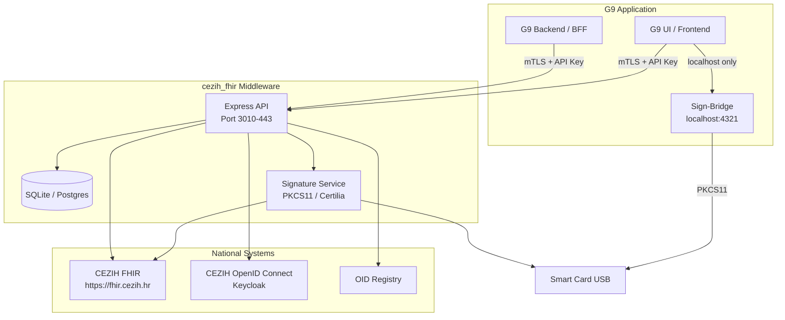

# G9 Application — Full Integration Requirements
### For integration with the `cezih_fhir` CEZIH FHIR Middleware

**Document Version**: 1.0  
**Date**: 2026-02-24  
**Status**: Draft — Requirements Definition

---

## Overview

This document defines the **complete set of requirements** for a G9-class clinic management application (covering Appointments, Patient Management, Scheduling, and Billing) to fully interoperate with the `cezih_fhir` middleware and, through it, with the Croatian national CEZIH FHIR system.

It covers:
- All middleware API calls (what G9 must call, and what data flows back)
- Security architecture requirements (mTLS, signing bridge, Zero Trust, IP pinning)
- Data model requirements (patient identifiers, FHIR concepts)
- Operational and compliance requirements

---

## Part 1: Core Functional Modules

The G9 application must implement the following clinical modules to be fully compatible with the CEZIH workflow:

| Module | Description | CEZIH Impact |
|:---|:---|:---|
| **Patient Management** | Registration, search, demographics | MBO lookup, foreigner registration |
| **Appointments / Scheduling** | Calendar, slot booking, arrival tracking | Visit (Encounter) creation |
| **Clinical Documentation** | Doctor's findings, diagnoses, procedures | ITI-65 document sending |
| **Episode Management** | Long-term treatment tracking | EpisodeOfCare (Case) lifecycle |
| **Billing** | Service charges, HZZO claims | Linked to closed Encounters |
| **Digital Signing** | Per-doctor signature for each finding | Smart Card / Certilia / Sign-Bridge |
| **Terminology / Codebooks** | MKB-10 diagnoses, procedure codes | Synchronized from CEZIH (ITI-95/96) |
| **Audit Trail** | Legal compliance log of all CEZIH transactions | GDPR / HZZO obligation |

---

## Part 2: Complete API Communication Matrix

All requests originate from G9 → Middleware (`http(s)://<middleware-host>/api`). The middleware handles all CEZIH communication internally.

### 2.1 Authentication (TC 1–3)

| # | Direction | Method | Endpoint | Purpose | Auth Required |
|:--|:--|:--|:--|:--|:--|
| TC1 | G9 → MW | `GET` | `/api/auth/smartcard` | Initiate Smart Card (AKD/Gemalto) OAuth2 login | No |
| TC2 | G9 → MW | `GET` | `/api/auth/certilia` | Initiate Certilia mobile.ID login | No |
| TC3 | G9 → MW | `POST` | `/api/auth/system-token` | M2M system token for background sync | No |
| — | G9 → MW | `GET` | `/api/auth/callback` | OAuth2 callback (redirect from CEZIH IdP) | No |

**G9 Must Store**:
- The returned `access_token` (Bearer) for all subsequent calls
- The `sessionId` to correlate doctor sessions

---

### 2.2 OID Management (TC 6)

| # | Direction | Method | Endpoint | Purpose |
|:--|:--|:--|:--|:--|
| TC6 | G9 → MW | `POST` | `/api/oid/generate` | Request unique OID(s) for new clinical documents |

**Request**:
```json
{ "quantity": 1 }
```
**Response**: An array of OID strings (e.g., `"2.16.756.5.30.1.1.xxx"`).  
**G9 must store** the returned OID as the primary ID of each generated clinical document.

---

### 2.3 Terminology / Codebooks (TC 7–8)

| # | Direction | Method | Endpoint | Purpose | Frequency |
|:--|:--|:--|:--|:--|:--|
| TC7 | G9 → MW | `POST` | `/api/terminology/sync` | Force full sync of all CodeSystems and ValueSets | On startup / weekly |
| TC8 | G9 → MW | `GET` | `/api/terminology/value-sets` | Retrieve all allowed FHIR ValueSets | On startup |
| — | G9 → MW | `GET` | `/api/terminology/code-systems` | Retrieve all active CodeSystems | On startup |
| — | G9 → MW | `GET` | `/api/terminology/diagnoses?q=<term>` | **Autocomplete** MKB-10 diagnosis search | Per keypress in UI |

> [!IMPORTANT]
> G9 **MUST** use `/api/terminology/diagnoses?q=` to power its diagnosis autocomplete field. Only codes present in the local CEZIH-synced codebook are valid. Sending an invalid MKB-10 code will result in a hard rejection from CEZIH.

---

### 2.4 Healthcare Registry (TC 9)

| # | Direction | Method | Endpoint | Purpose |
|:--|:--|:--|:--|:--|
| TC9 | G9 → MW | `GET` | `/api/registry/organizations?name=` | Search for healthcare organizations (mCSD) |
| — | G9 → MW | `GET` | `/api/registry/practitioners?name=` | Search for practitioners in the national registry |

---

### 2.5 Patient Management (TC 10–11)

| # | Direction | Method | Endpoint | Purpose |
|:--|:--|:--|:--|:--|
| TC10 | G9 → MW | `GET` | `/api/patient/search?mbo=<9-digits>` | **Primary MBO lookup** on CEZIH — returns full patient demographics |
| TC10b | G9 → MW | `GET` | `/api/patient/search?oib=<11-digits>` | OIB-based lookup (alternative) |
| — | G9 → MW | `GET` | `/api/patient/search-remote?mbo=<mbo>` | Force remote CEZIH lookup (bypass local cache) |
| — | G9 → MW | `POST` | `/api/patient/sync` | Pull latest demographics from CEZIH into local MW cache |
| — | G9 → MW | `GET` | `/api/patient/registry?q=<query>` | Fuzzy-search across all **locally cached** patients |
| — | G9 → MW | `GET` | `/api/patient/:mbo/chart` | **Aggregated patient chart**: demographics + all visits + documents + active cases |
| TC11 | G9 → MW | `POST` | `/api/patient/foreigner/register` | Register a foreign patient (no HR insurance) |

**TC10 Response — Patient Demographics**:
```json
{
  "mbo": "123456789",
  "oib": "12345678901",
  "name": { "family": "Horvat", "given": ["Ivan"] },
  "birthDate": "1985-03-15",
  "gender": "M",
  "address": { "city": "Zagreb", "postalCode": "10000" },
  "insurance": { "validFrom": "...", "validTo": "...", "status": "active" }
}
```

**TC11 — Foreign Patient Registration Request**:
```json
{
  "name": { "family": "Müller", "given": ["Hans"] },
  "birthDate": "1980-01-01",
  "nationality": "DE",
  "passportNumber": "DE123456789",
  "ekzoNumber": "XYZ987654321"
}
```

> [!IMPORTANT]
> **MBO is the golden key.** G9 must store MBO as a non-nullable field on every patient record. All downstream API calls require MBO. It is a 9-digit number issued by HZZO.

---

### 2.6 Visits / Encounters (TC 12–14)

A **Visit** maps to a single physical appointment in G9 and a FHIR `Encounter` sent to CEZIH.

| # | Direction | Method | Endpoint | Purpose |
|:--|:--|:--|:--|:--|
| TC12 | G9 → MW | `POST` | `/api/visit/create` | Open a new visit (Encounter start) |
| TC13 | G9 → MW | `PUT` | `/api/visit/:id` | Update visit details (add diagnosis) |
| TC14 | G9 → MW | `POST` | `/api/visit/:id/close` | Close the visit (Encounter end) |
| — | G9 → MW | `GET` | `/api/visit/all?patientMbo=` | List all visits for a patient |

**TC12 Create Visit Request**:
```json
{
  "patientMbo": "123456789",
  "startDate": "2026-02-24T10:00:00Z",
  "class": "AMB",
  "practitionerMbo": "987654321",
  "caseId": "CASE_ID_IF_LINKED"
}
```

**Visit Classes** (G9 must support):
| Code | Description |
|:---|:---|
| `AMB` | Ambulatory / Outpatient |
| `IMP` | Inpatient |
| `EMER` | Emergency |
| `HH` | Home health visit |

---

### 2.7 Cases / Episodes of Care (TC 15–17)

A **Case** is a long-running treatment episode (e.g., "Post-surgery physiotherapy"). It groups multiple visits.

| # | Direction | Method | Endpoint | Purpose |
|:--|:--|:--|:--|:--|
| TC15 | G9 → MW | `GET` | `/api/case/patient/:mbo` | Retrieve all cases for a patient |
| TC16 | G9 → MW | `POST` | `/api/case/create` | Create a new episode of care |
| TC17 | G9 → MW | `PUT` | `/api/case/:id` | Update / close a case |

**TC16 Create Case Request**:
```json
{
  "patientMbo": "123456789",
  "title": "Fizikalna terapija",
  "startDate": "2026-02-24T08:00:00Z",
  "diagnosisCode": "M17.1",
  "practitionerMbo": "987654321"
}
```

**TC17 Close Case Request**:
```json
{
  "status": "finished",
  "endDate": "2026-03-15T16:00:00Z"
}
```

---

### 2.8 Clinical Documentation (TC 18–22)

This is the **core CEZIH transaction** — sending a signed medical finding (ITI-65).

| # | Direction | Method | Endpoint | Purpose |
|:--|:--|:--|:--|:--|
| TC18 | G9 → MW | `POST` | `/api/document/send` | Send a signed clinical document to CEZIH |
| TC19 | G9 → MW | `POST` | `/api/document/replace` | Replace/correct a previously sent document |
| TC20 | G9 → MW | `POST` | `/api/document/cancel` | Cancel (storno) a document |
| TC21 | G9 → MW | `GET` | `/api/document/search?patientMbo=` | Retrieve list of all documents for a patient (ITI-67) |
| TC22 | G9 → MW | `GET` | `/api/document/retrieve?url=urn:oid:...` | Retrieve and decode a specific document (ITI-68) |

**TC18 — Send Document Request (Full)**:
```json
{
  "type": "AMBULATORY_REPORT",
  "patientMbo": "123456789",
  "visitId": "local-visit-id",
  "caseId": "local-case-id",
  "practitionerMbo": "987654321",
  "anamnesis": "Pacijent se žali na bol...",
  "status": "Stabilno stanje.",
  "finding": "Nalaz urednog statusa.",
  "therapy": "Ibuprofen 400mg 3x1",
  "recommendation": "Kontrola za 30 dana.",
  "diagnosisCode": "M17.1",
  "procedureCodes": ["94.01"],
  "closeVisit": true
}
```

**Document Types** (G9 must present these to the doctor):
| Type Code | Description |
|:---|:---|
| `AMBULATORY_REPORT` | Standard outpatient finding |
| `SPECIALIST_REPORT` | Specialist examination report |
| `LAB_RESULT` | Laboratory test results |
| `RADIOLOGY_REPORT` | Radiology/imaging report |
| `DISCHARGE_SUMMARY` | Hospital discharge summary |
| `REFERRAL` | Uputa / referral letter |
| `PRESCRIPTION` | e-Recept / prescription |

**TC19 — Replace Document**:
```json
{
  "originalDocumentOid": "2.16.840.1.113883.xxx",
  "type": "AMBULATORY_REPORT",
  "patientMbo": "123456789",
  "anamnesis": "Ispravljena anamneza...",
  "diagnosisCode": "M17.1",
  "closeVisit": false
}
```

**TC20 — Cancel Document**:
```json
{ "documentOid": "2.16.840.1.113883.xxx" }
```

> [!WARNING]
> **Text Limits**: `anamnesis`, `finding`, `therapy`, `recommendation` fields are each limited to **4,000 characters**. G9 UI must enforce this client-side with a visible character counter.

---

### 2.9 Audit & Telemetry

| Direction | Method | Endpoint | Purpose |
|:--|:--|:--|:--|
| G9 → MW | `GET` | `/api/audit/logs?limit=100` | Retrieve recent CEZIH transaction audit log |
| G9 → MW | `GET` | `/api/audit/logs/:visitId` | Retrieve audit log for a specific visit |

> [!NOTE]
> In **Zero-Storage mode**, the middleware returns the full signed JWS payload and raw CEZIH response in every `/document/send` response body. G9 is then **legally responsible** for storing this audit data in its own durable, tamper-proof log.

---

### 2.10 System Health & Settings

| Direction | Method | Endpoint | Purpose |
|:--|:--|:--|:--|
| G9 → MW | `GET` | `/api/health` | Health check — connection status to CEZIH |
| G9 → MW | `GET` | `/api/settings` | Retrieve middleware configuration |
| G9 → MW | `POST` | `/api/settings/sync` | Force re-sync of all configuration from CEZIH |

---

## Part 3: Patient Identifier Reference

G9 must understand and correctly handle the following CEZIH patient identifiers:

| Identifier | System | Format | Required? | Notes |
|:---|:---|:---|:---|:---|
| **MBO** | `urn:oid:2.16.840.1.113883.2.26.2` | 9 digits | **Mandatory** for HR citizens | Primary key for all CEZIH operations |
| **OIB** | `urn:oid:2.16.840.1.113883.2.26.98` | 11 digits | Alternative search | Personal Tax ID |
| **Passport Number** | Local string | Alphanumeric | For foreigners | Alternative identity document |
| **EKZO** | `urn:oid:2.16.840.1.113883.2.26.10` | Alphanumeric | For EU citizens | European Health Insurance Card number |
| **Encounter ID** | Local UUID | UUID v4 | Mandatory | Locally generated, used in document payloads |
| **EpisodeOfCare ID** | Local UUID | UUID v4 | If using cases | Identifies the treatment episode |
| **Document OID** | `urn:oid:2.16.840.1.113883.xxx` | OID notation | Mandatory | Generated via `/api/oid/generate` before sending |

---

## Part 4: Security Architecture Requirements

> [!CAUTION]
> Security requirements are **non-negotiable** for any production certification by HZZO/CEZIH. All of the following must be implemented before a production go-live.

### 4.1 Transport Security: mTLS (Mutual TLS)

**What**: Both G9 and the middleware must present X.509 certificates during the TLS handshake. Standard one-way HTTPS is insufficient for a production deployment.

**Requirements for G9**:
- [ ] G9 must hold a **client TLS certificate** (issued by an approved CA, or self-signed with the MW CA for internal use).
- [ ] The G9 HTTP client (Axios, fetch, etc.) must be configured to send this client certificate on every request to the middleware.
- [ ] The middleware is the server; it will validate G9's certificate against its trusted CA bundle.
- [ ] Certificate rotation procedure must be documented and automatable (certs expire; manual rotation is a security liability).

**Middleware-side (already planned)**:
- The Express server will be extended to require `requestCert: true` and `rejectUnauthorized: true` on the HTTPS server instance.
- A CA certificate bundle will be maintained for authorized G9 clients.

**What must be exchanged during onboarding**:
1. G9 generates a keypair + CSR.
2. Admin signs it with the Middleware CA.
3. G9 installs the signed cert + MW CA root cert.
4. MW admin adds G9's cert fingerprint to the allowlist.

---

### 4.2 API Key Authentication (Layer 2, Current State)

Until mTLS is in place, G9 must send:
```http
X-API-KEY: <organization-specific-secret-key>
Authorization: Bearer <user-or-system-token>
```

- The `X-API-KEY` is a **per-organization** secret, issued at onboarding.
- Keys are rotated quarterly or upon suspected compromise.
- The middleware validates the key and maps it to an `organization_id`, enabling per-organization audit logging and data isolation.

---

### 4.3 Digital Signing: Sign-Bridge (Local Signing Agent)

**When required**: When doctors use physical AKD/Gemalto Smart Cards and the middleware is hosted remotely (cloud or central server).

**Architecture**:
1. The **Sign-Bridge** is a tiny background service (`signing-bridge.ts`) installed on each doctor's Windows/Mac workstation.
2. It listens on `http://localhost:4321` and only accepts connections from `127.0.0.1` (loopback only).
3. The G9 web frontend communicates with it directly from the browser.

**G9 Requirements for Sign-Bridge Integration**:
- [ ] G9 frontend must **detect** if Sign-Bridge is available: `GET http://localhost:4321/health`.
- [ ] If unavailable, G9 must offer Certilia mobile.ID as a fallback.
- [ ] G9 must call `POST http://localhost:4321/sign` with the canonical document hash before calling `/api/document/send`.
- [ ] The returned JWS signature string must be included in the `/api/document/send` body as `externalSignature`.

**Sign-Bridge Endpoints** (implemented in `signing-bridge.ts`):
```
GET  http://localhost:4321/health         → { status: 'ok', cardPresent: true }
POST http://localhost:4321/sign           → { signature: '<JWS_COMPACT_TOKEN>' }
```

**G9 Signing Flow (Smart Card)**:
```
1. Doctor clicks "Sign & Send"
2. G9 calls GET /api/document/prepare   → receives { hashToSign, canonicalJson }
3. G9 calls POST localhost:4321/sign    → receives { signature }
4. G9 calls POST /api/document/send     → includes { externalSignature: signature }
5. Middleware validates signature and forwards to CEZIH
```

> [!NOTE]
> The Sign-Bridge must be distributed to all doctor workstations via GPO (Windows Group Policy) or MDM (Jamf/Intune for Mac). G9 should provide an MSI/PKG installer package.

---

### 4.4 Zero Trust Tunnels (Cloudflare Tunnel / Tailscale)

**When required**: When the middleware (Sign-Bridge or central server) is on-premises but must be reachable by cloud components or remote G9 instances without opening inbound firewall ports.

**Requirements for G9**:
- [ ] G9 must support configuring the middleware base URL to a Cloudflare Tunnel or Tailscale FQDN (e.g., `https://middleware.yourclinic.com`).
- [ ] G9 must **not** hardcode `localhost:3010`; all middleware URLs must be configurable via environment variables or admin settings.
- [ ] G9 must support the `CF-Connecting-IP` or `Tailscale-User` headers that tunnels inject, for audit attribution.

**Tunnel Architecture for Sign-Bridge**:
- The Sign-Bridge is inherently local (`localhost:4321`) — it must **never** be exposed through a public tunnel.
- The central middleware server can have a Cloudflare Tunnel for remote G9 access.

---

### 4.5 IP Pinning / Whitelisting

**What**: CEZIH requires the middleware's outbound IP to be registered and whitelisted at the national firewall. G9 indirectly benefits from this.

**Requirements for G9**:
- [ ] G9 must always route traffic through the registered middleware (not directly to CEZIH).
- [ ] In production, the G9 application **must only** be allowed to call the middleware from known, static IP ranges (enforced by the middleware's IP whitelist or firewall rules).
- [ ] G9's deployment environment (server IP or office egress IP) must be communicated to the middleware administrator during onboarding so it can be added to the allowlist.
- [ ] G9 **must not** attempt to contact `cezih.hr` or `hzzo.hr` endpoints directly. All CEZIH communication goes through the middleware.

**IP Pinning for the Sign-Bridge → Central Middleware path**:
- The Central Middleware must only accept Sign-Bridge callback requests from known G9 server IPs.
- If using Cloudflare Tunnel, restrict `CF-Connecting-IP` to the G9 server's IP.

---

### 4.6 Session Management & Token Security

| Requirement | Detail |
|:---|:---|
| **Token storage** | G9 must store user tokens in **memory or httpOnly cookies only** — never in `localStorage` |
| **Token expiry** | G9 must handle `401 Unauthorized` responses by triggering a re-authentication flow |
| **Session isolation** | Each doctor's session must use their own Bearer token — tokens must never be shared across users |
| **Logout** | G9 must invalidate the local session and purge the token on logout |
| **System token** | The M2M system token (TC3) should be cached and refreshed 60 seconds before expiry |

---

### 4.7 HTTPS / TLS Requirements

| Requirement | Minimum Standard |
|:---|:---|
| **Minimum TLS version** | TLS 1.2 (TLS 1.3 strongly preferred) |
| **Cipher suites** | ECDHE-RSA-AES256-GCM-SHA384 or stronger |
| **Certificate** | Valid, CA-signed TLS cert for the middleware URL (Let's Encrypt acceptable for internal) |
| **HSTS** | `Strict-Transport-Security: max-age=31536000` header required |
| **No mixed content** | G9 frontend must be served over HTTPS; no HTTP resources loaded |

---

## Part 5: Data Model Requirements for G9

G9's internal database must store the following CEZIH-relevant fields:

### 5.1 Patient Table

| Field | Type | Source | Required |
|:---|:---|:---|:---|
| `mbo` | VARCHAR(9) | CEZIH via `/patient/search` | **YES** |
| `oib` | VARCHAR(11) | CEZIH | Optional |
| `first_name` | VARCHAR | CEZIH | YES |
| `last_name` | VARCHAR | CEZIH | YES |
| `date_of_birth` | DATE | CEZIH | YES |
| `gender` | ENUM | CEZIH | YES |
| `insurance_status` | VARCHAR | CEZIH | YES |
| `insurance_valid_to` | DATE | CEZIH | Recommended |
| `is_foreigner` | BOOLEAN | G9 | YES |
| `passport_number` | VARCHAR | G9 | If foreigner |
| `ekzo_number` | VARCHAR | G9 | If EU foreigner |
| `cezih_synced_at` | TIMESTAMP | MW | Recommended |

### 5.2 Visit (Appointment) Table

| Field | Type | Source | Required |
|:---|:---|:---|:---|
| `id` | UUID | G9 | YES |
| `cezih_encounter_id` | VARCHAR | MW response | **YES** |
| `patient_mbo` | VARCHAR(9) | G9 | YES |
| `case_id` | UUID | G9 | Optional |
| `start_date` | TIMESTAMP | G9 | YES |
| `end_date` | TIMESTAMP | G9 | On close |
| `class` | ENUM (AMB/IMP/EMER/HH) | G9 | YES |
| `status` | ENUM | G9 | YES |
| `practitioner_mbo` | VARCHAR | G9 | YES |
| `diagnosis_code` | VARCHAR | G9 | YES |

### 5.3 Clinical Document Table

| Field | Type | Source | Required |
|:---|:---|:---|:---|
| `id` | UUID | G9 | YES |
| `oid` | VARCHAR | MW (`/oid/generate`) | **YES** |
| `visit_id` | UUID | G9 | YES |
| `type` | ENUM | G9 | YES |
| `status` | ENUM (current/replaced/cancelled) | G9/MW | YES |
| `diagnosis_code` | VARCHAR | G9 | YES |
| `cezih_response_raw` | JSONB | MW response | **YES (audit)** |
| `jws_payload` | TEXT | MW response | **YES (audit)** |
| `signed_at` | TIMESTAMP | MW response | YES |
| `practitioner_mbo` | VARCHAR | G9 | YES |

---

## Part 6: Not-Yet-Implemented Middleware Capabilities (Roadmap Items)

The following features are **expected by G9** but not yet implemented in the middleware. G9 should design placeholder hooks for these.

| Feature | Priority | Notes |
|:---|:---|:---|
| **mTLS Client Cert Validation** | P1 | Required for production. MW needs `requestCert` mode enabled. |
| **`/api/document/prepare`** | P1 | Returns `hashToSign` for Sign-Bridge flow. Currently not exposed as a standalone endpoint. |
| **`externalSignature` in `/document/send`** | P1 | Middleware must accept pre-computed JWS from Sign-Bridge. |
| **Per-organization API Key management** | P1 | DB-backed key issuance + rotation. |
| **`/api/auth/refresh`** | P2 | Proactive token refresh before expiry. |
| **`/api/billing/claim`** | P2 | HZZO billing claim submission (future). |
| **`/api/prescription/send`** | P2 | e-Recept submission to CEZIH (future). |
| **`/api/referral/send`** | P2 | e-Uputa / referral letter (future). |
| **WebSocket / SSE for async events** | P3 | Notify G9 when Certilia mobile.ID signing is approved. |
| **`/api/patient/history`** | P3 | Full patient history across all visits/orgs (requires elevated CEZIH scope). |
| **Postgres migration** | P1 | SQLite → Postgres for multi-tenant, concurrent G9 instances. |

---

## Part 7: Deployment & Infrastructure Requirements

### 7.1 Network Requirements

| Requirement | Detail |
|:---|:---|
| **Middleware URL** | Must be configurable in G9 (not hardcoded) |
| **Outbound from G9** | HTTPS to middleware on port 443 (or 3010 in dev) |
| **Inbound to Middleware** | Must have a static, registered IP (CEZIH whitelisting) |
| **CEZIH VPN/Firewall** | The middleware server's IP must be whitelisted at HZZO's national firewall |
| **Sign-Bridge** | `localhost:4321` is local-only; no external routing needed |

### 7.2 Environment Configuration (G9 Side)

G9 must expose the following configurable settings (via admin UI or `.env`):

```env
# Middleware Connection
MIDDLEWARE_BASE_URL=https://middleware.yourclinic.com/api
MIDDLEWARE_API_KEY=<organization-secret>

# mTLS Certificates (when enabled)
MTLS_CLIENT_CERT_PATH=./certs/g9-client.crt
MTLS_CLIENT_KEY_PATH=./certs/g9-client.key
MTLS_CA_CERT_PATH=./certs/middleware-ca.crt

# Sign-Bridge (local workstation)
SIGN_BRIDGE_URL=http://localhost:4321
SIGN_BRIDGE_ENABLED=true

# Signing Mode
SIGNING_MODE=bridge  # Options: bridge | certilia | system
```

### 7.3 Sign-Bridge Installer Requirements

| Requirement | Detail |
|:---|:---|
| **Supported OS** | Windows 10/11, macOS 12+ |
| **Installation method** | MSI (Windows) / PKG (macOS) deployable via GPO/MDM |
| **Service name** | `CezihSignBridge` (registered as a system service) |
| **Auto-start** | Must start automatically on system boot |
| **Requirement** | AKD middleware (PKCS#11 DLL) must be installed first |
| **Port** | `4321` — must be allowed through Windows Firewall (local only) |
| **Smart Card library** | Windows: `akd-pkcs11.dll`; macOS: `akd-pkcs11.dylib` |

---

## Part 8: Compliance & Certification Requirements

### 8.1 CEZIH Test Cases (22 mandatory)

G9 integration will only be certified after all 22 CEZIH test cases pass in the CEZIH pilot environment. The G9 application is responsible for triggering these test cases via the middleware.

| TC Range | Domain | Status |
|:---|:---|:---|
| TC 1-5 | Authentication & Signing | Middleware ready; G9 must integrate UI |
| TC 6-9 | Infrastructure & Registry | Middleware ready |
| TC 10-11 | Patient Registration | Middleware ready |
| TC 12-17 | Visits & Episodes | Middleware ready |
| TC 18-22 | Clinical Documents | Middleware ready |

### 8.2 GDPR / Data Compliance

| Requirement | Implementation |
|:---|:---|
| **Audit log retention** | Minimum 5 years, tamper-proof |
| **Data minimization** | G9 should not cache CEZIH data beyond operational need |
| **Patient consent** | G9 must record explicit consent for data processing |
| **Right to access** | G9 must be able to produce a patient's full data export |
| **Breach notification** | G9 must have an incident response procedure documented |
| **Data sovereignty** | For Croatian clinics: data must reside on Croatian/EU servers |

### 8.3 Business Continuity

| Scenario | G9 Requirement |
|:---|:---|
| **Middleware unavailable** | G9 queues CEZIH operations locally; retries on reconnect |
| **CEZIH unavailable** | Middleware returns specific error; G9 allows local-only mode |
| **Sign-Bridge unavailable** | G9 auto-falls back to Certilia mobile.ID |
| **Token expired** | G9 transparently refreshes the token and retries the request |

---

## Part 9: G9 UI Requirements for CEZIH Workflow

The following UI elements are mandatory for a smooth clinical workflow:

| UI Element | Purpose |
|:---|:---|
| **MBO Search box** | Primary patient lookup — calls `/patient/search?mbo=` |
| **Patient verification banner** | Shows HZZO insurance status (active/expired) from patient demographics |
| **Diagnosis autocomplete** | Calls `/terminology/diagnoses?q=` — powered by local CEZIH codebook |
| **Signing status indicator** | Shows: "Smart Card detected / Certilia active / No signing available" |
| **Document status badge** | Shows `current` / `replaced` / `cancelled` per clinical document |
| **CEZIH submission result** | Success: "Nalaz poslan CEZIH-u ✓" / Error: human-readable error text |
| **Audit log viewer** | Admin-only view of all CEZIH transactions for the organization |
| **Middleware health widget** | Small status indicator showing MW + CEZIH connectivity |
| **Character counter** | Live counter on anamnesis/finding/therapy/recommendation fields (max 4000) |

---

## Appendix A: Summary Communication Diagram



---

## Appendix B: Onboarding Checklist (G9 Integrator)

- [ ] Obtain `ORGANIZATION_OIB`, `ORGANIZATION_HZZO_CODE`, `ORGANIZATION_HZJZ_CODE` from HZZO
- [ ] Receive `MIDDLEWARE_API_KEY` from middleware administrator
- [ ] Configure `MIDDLEWARE_BASE_URL` in G9 environment
- [ ] Run `POST /api/terminology/sync` on first startup
- [ ] Verify patient search with a test MBO in pilot environment
- [ ] Implement MBO/OIB as non-nullable DB fields
- [ ] Implement diagnosis autocomplete via `/api/terminology/diagnoses`
- [ ] Complete all 22 test cases in CEZIH pilot environment
- [ ] Generate and exchange mTLS client certificates
- [ ] Deploy Sign-Bridge to each doctor workstation (if using Smart Cards)
- [ ] Configure Certilia mobile.ID as fallback signing option
- [ ] Confirm static outbound IP is whitelisted by CEZIH/HZZO
- [ ] Enable TLS 1.2+ on all G9 endpoints
- [ ] Implement audit log storage (own DB) if operating in Zero-Storage middleware mode
- [ ] Complete GDPR Data Processing Agreement (DPA) with middleware operator
