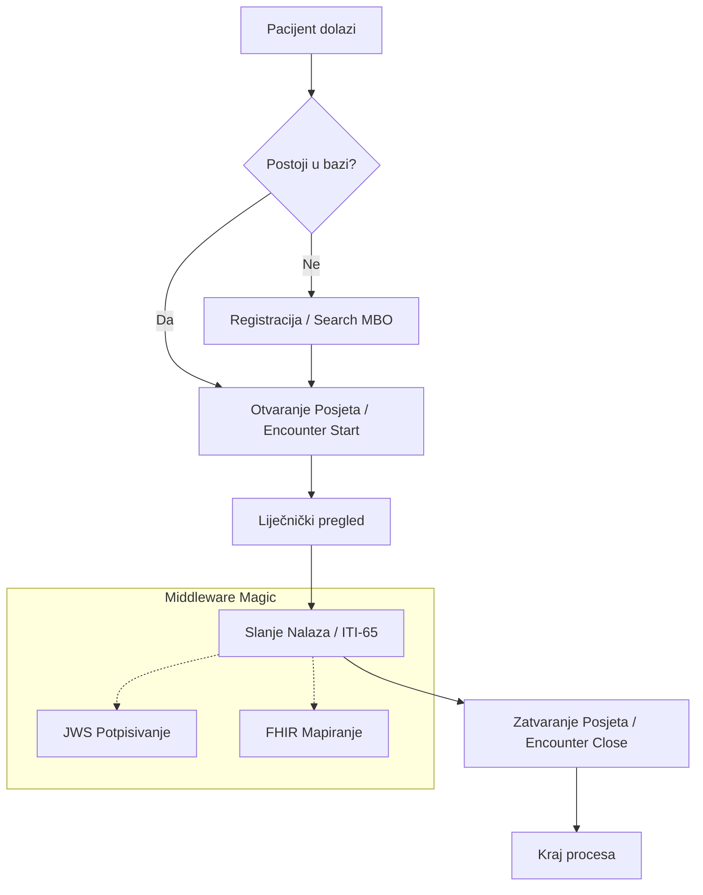
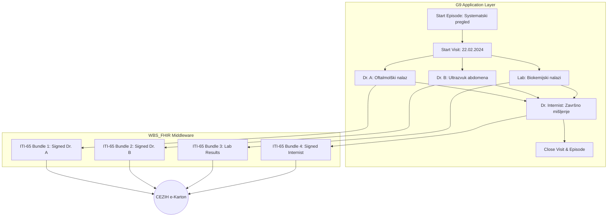

# 🩺 G9 Integration Guide: WBS_FHIR Middleware

Dobrodošli u službeni vodič za integraciju G9 aplikacija s **WBS_FHIR** middleware-om.

## 📖 Uvod i Svrha
Ovaj sustav služi kao posrednik (Black Box) koji preuzima svu kompleksnost komunikacije s nacionalnim **CEZIH FHIR** sustavom. Primarna svrha middleware-a je omogućiti privatnim zdravstvenim ustanovama (koje ne koriste standardne HZZO usluge e-Uputnica/e-Recept) razmjenu digitalnih medicinskih podataka s CEZIH sustavom:
- **Dolazaka pacijenata** u ustanovu.
- **Dugotrajnih epizoda liječenja** (Slučajeva).
- **Pojedinačnih posjeta** (Ambulantnih pregleda).
- **Medicinskih nalaza** i kliničkih podataka.


## 🔗 1. Korisni Linkovi i Resursi

Službena dokumentacija nacionalnog sustava (korisno za razumijevanje pozadinskih procesa):

*   **[CEZIH FHIR Osnova - Početna (Simplifier)](https://simplifier.net/guide/cezih-osnova/Početna?version=1.0)** - Struktura resursa i profila.
*   **[CEZIH FHIR Projektna stranica](https://simplifier.net/cezih-osnova)** - Svi CodeSystemi i ValueSetovi.
*   **[HZZO Portal za partnere](https://www.hzzo.hr)** - Administrativne upute.


## 🏗️ 2. Osnovni Koncepti (Health Systems 101)

Za uspješnu integraciju, G9 developeri moraju usvojiti sljedeću hijerarhiju podataka. Middleware osigurava mapiranje ovih koncepata na FHIR standard.

### 📊 Pregled Medicinskih Resursa
| Koncept | FHIR Resource | Opis | Obvezno za G9 |
| :--- | :--- | :--- | :--- |
| **MBO** | `Identifier` | Matični broj osiguranika (9 znamenki). **Zlatni Ključ.** | **DA** |
| **Slučaj (Epizoda)** | `EpisodeOfCare` | Skup svih radnji vezanih uz jedan medicinski problem. | Preporučeno |
| **Posjet (Pregled)** | `Encounter` | Pojedinačni posjet pacijenta ordinaciji. | **DA** |
| **Postupak** | `Procedure` | Konkretna radnja (npr. dijagnostika, previjanje). | Ovisno o nalazu |


### 🔄 Razlika: Slučaj (Episode) vs. Posjet (Encounter)
| Karakteristika | Slučaj (EpisodeOfCare) | Posjet (Encounter) |
| :--- | :--- | :--- |
| **Trajanje** | Dugotrajno (tjedni/mjeseci) | Trenutačno (sat/dan) |
| **Svrha** | Praćenje cijelog procesa liječenja | Evidencija fizičkog dolaska |
| **Sadržaj** | Može sadržavati više Posjeta | Odnosi se na točno jedan termin |
| **Primjer** | "Fizikalna terapija nakon operacije" | "Prvi termin vježbi - 22.02." |

### 🎭 CEZIH Role i Dozvole
| Rola | Opis | Dozvoljene Akcije |
| :--- | :--- | :--- |
| **Liječnik** | Individualni zdravstveni radnik | Slanje nalaza, Storniranje, Epizode |
| **Sestra / Admin** | Administrativno osoblje | Prijava dolaska, Pretraga pacijenata |
| **Tehnički Sustav** | Pozadinski servis (G9) | Sinkronizacija šifrarnika, Generiranje OID-ova |

## 🛤️ 3. Standardni Tijek Rada (Visual Workflow)

Sljedeći dijagram prikazuje tipičan životni ciklus pacijenta u privatnoj poliklinici kroz middleware:



## 🏥 4. Složeni Slučaj: Sistematski pregled (Systematic Review)

Sistematski pregled predstavlja paket više postupaka, različitih liječnika i zasebnih kliničkih dokumenata, povezanih unutar jedne koordinacijske točke.

### Vizualni Prikaz Tjeka Rada



### Tehnička Implementacija za G9:

1.  **Grupiranje**: Kreirajte jedan `EpisodeOfCare` na početku dana. To je "mapa" u koju se spremaju svi budući nalazi.
2.  **Konkurentnost**: Više liječnika (sa različitih radnih stanica) može slati dokumente neovisno, koristeći isti `visitId` i `caseId`.
3.  **Odgovornost**: Svaki liječnik potpisuje **samo svoj dokument**. Middleware se brine da se potpis ispravno upakira u odgovarajući JWS bundle.
4.  **Consolidation**: Završni "Internistički nalaz" može u tekstu referencirati OID-ove prethodno poslanih dokumenata kako bi se pružio ujedinjeni pacijentov prikaz.

---

## 🌍 5. Strani državljani (Foreign Citizens)

Middleware podržava **TC 11** (Registracija stranaca) za pacijente bez HR osiguranja.

### A. Identifikatori za strance
G9 aplikacija mora koristiti:
1.  **Broj Putovnice** (`putovnica`)
2.  **EKZO** (`europska-kartica`) - Europska kartica zdravstvenog osiguranja.

### B. Registracija (Proces)
**Endpoint**: `POST /api/patient/foreigner/register`
```json
{
  "name": {"family": "Doe", "given": ["John"]},
  "birthDate": "1980-01-01",
  "nationality": "DE",
  "passportNumber": "XYZ123456"
}
```

## 🔐 6. Autentifikacija i Sigurnost

Middleware automatski upravlja digitalnim potpisivanjem i JWS tokenima.

*   **Sustavna (M2M)**: `POST /api/auth/system-token` (za sinkronizaciju).
*   **Korisnička**: `/api/auth/smartcard` ili `/api/auth/certilia` (za klinički rad).

---

## 🧪 7. Katalog Testnih Slučajeva (Request/Response)

Službeni katalog od 22 testna slučaja (TC) potrebnih za certifikaciju. Svi zahtjevi se šalju na `http://localhost:3010/api`.

### 7.1 Autentifikacija i Autorizacija (TC 1-5)
| TC | Naziv | Endpoint | Opis |
| :--- | :--- | :--- | :--- |
| **TC 1** | Smart Card Auth | `GET /auth/smartcard` | Inicijalizacija prijave fizičkom karticom. |
| **TC 2** | Certilia mobile.ID | `GET /auth/certilia` | Inicijalizacija prijave preko mobitela. |
| **TC 3** | System Auth | `POST /auth/system-token` | M2M autentifikacija za pozadinske procese. |
| **TC 4** | Sign (Smart Card) | `POST /sign/smartcard` | Digitalno potpisivanje fizičkom karticom. |
| **TC 5** | Sign (Mobile Cloud) | `POST /sign/certilia` | Digitalno potpisivanje u oblaku (Certilia). |

### 7.2 Infrastruktura i Registri (TC 6-9)
| TC | Naziv | Endpoint | Opis |
| :--- | :--- | :--- | :--- |
| **TC 6** | OID Generiranje | `POST /oid/generate` | Generiranje jedinstvenih OID-ova za dokumente. |
| **TC 7** | Sync CodeSystems | `POST /terminology/sync` | Sinkronizacija šifrarnika (ITI-96). |
| **TC 8** | Sync ValueSets | `GET /terminology/value-sets` | Dohvat dozvoljenih vrijednosti (ITI-95). |
| **TC 9** | Registar (mCSD) | `GET /registry/organizations` | Pretraga zdravstvenih ustanova. |

### 7.3 Pacijenti i Registracija (TC 10-11)
```json
// TC 10: Pretraga pacijenta (GET /api/patient/search?mbo=123456789)
// Vraća podatke iz nacionalnog registra pacijenata.

// TC 11: Registracija stranca (POST /api/patient/foreigner/register)
{
  "name": {"family": "Doe", "given": ["John"]},
  "birthDate": "1980-01-01",
  "nationality": "DE",
  "passportNumber": "XYZ123456"
}
```

### 7.4 Posjeti i Slučajevi (TC 12-17)
```json
// TC 12: Kreiranje posjete (POST /api/visit/create)
{ "patientMbo": "123456789", "startDate": "2024-02-22T10:00:00Z", "class": "AMB" }

// TC 13: Ažuriranje posjete (PUT /api/visit/:id)
{ "diagnosisCode": "M17.1" }

// TC 14: Zatvaranje posjete (POST /api/visit/:id/close)
{ "endDate": "2024-02-22T11:00:00Z" }

// TC 15: Dohvat slučajeva (GET /api/case/patient/:mbo)
// Vraća povijest slučajeva (EpisodeOfCare) za pacijenta.

// TC 16: Kreiranje slučaja (POST /api/case/create)
{ "patientMbo": "123456789", "title": "Fizikalna terapija", "startDate": "2024-02-22..." }

// TC 17: Ažuriranje slučaja (PUT /api/case/:id)
{ "status": "finished", "endDate": "..." }
```

### 7.5 Klinička Dokumentacija (TC 18-22)
```json
// TC 18: Slanje dokumenta (POST /api/document/send)
{
  "type": "AMBULATORY_REPORT",
  "patientMbo": "123456789",
  "anamnesis": "Pacijent žali na...",
  "diagnosisCode": "J00",
  "closeVisit": true
}

// TC 19: Zamjena dokumenta (POST /api/document/replace)
{ "originalDocumentOid": "1.2.3...", "anamnesis": "Ispravljen nalaz..." }

// TC 20: Storno dokumenta (POST /api/document/cancel)
{ "documentOid": "1.2.3..." }

// TC 21: Pretraga dokumenata (GET /api/document/search?patientMbo=123456789)
// Vraća listu svih poslanih dokumenata za pacijenta (ITI-67).

// TC 22: Dohvat dokumenta (GET /api/document/retrieve?url=urn:oid:1.2.3...)
// Vraća dekodirani sadržaj dokumenta u JSON formatu (ITI-68).
```

---

## 🔎 8. Napredno Pretraživanje i Dohvat

*   **Pretraga po OID-u**: `GET /api/document/search?oid=1.2.3...`
*   **Dohvat Sadržaja (ITI-68)**: `GET /api/document/retrieve?url=urn:oid:1.2.3...`
    *   *Middleware dekodira Base64 i vraća ljudima čitljiv JSON.*

---

## 🚫 9. Poslovna Pravila i Validacija (Strict)

1.  **MKB-10 Filter**: Zahtjev se odbija ako dijagnoza nije u važećem šifrarniku.
2.  **Text Limits**: Polja `anamnesis`, `finding`, `recommendation` max **4000 znakova**.
3.  **Auto-Close**: Slanje nalaza uz `closeVisit: true` automatski završava posjet.

---

---

## 🚀 10. CURL API Reference

G9 developeri mogu koristiti ove naredbe za brzo testiranje integracije iz terminala.

### A. Autentifikacija
```bash
# Dohvat sustavnog tokena
curl -X POST http://localhost:3010/api/auth/system-token

# Inicijalizacija SmartCard prijave
curl -X GET http://localhost:3010/api/auth/smartcard
```

### B. Posjeti i Pacijenti
```bash
# Otvaranje posjeta (Encounter Start)
curl -X POST http://localhost:3010/api/visit/create \
     -H "Content-Type: application/json" \
     -d '{"patientMbo": "123456789", "class": "AMB", "startDate": "2024-02-22T10:00:00Z"}'

# Pretraga pacijenta na CEZIH-u
curl -X GET "http://localhost:3010/api/patient/search?mbo=123456789" \
     -H "Authorization: Bearer <TOKEN>"
```

### C. Klinički Dokumenti (Nalazi)
```bash
# Slanje nalaza uz automatsko zatvaranje posjeta
curl -X POST http://localhost:3010/api/document/send \
     -H "Content-Type: application/json" \
     -d '{
       "type": "AMBULATORY_REPORT",
       "patientMbo": "123456789",
       "visitId": "VISIT_ID_HERE",
       "closeVisit": true,
       "anamnesis": "Pacijent se žali na bol...",
       "diagnosisCode": "J00",
       "title": "Nalaz specijalista"
     }'

# Storniranje dokumenta (TC 20)
curl -X POST http://localhost:3010/api/document/cancel \
     -H "Content-Type: application/json" \
     -d '{"documentOid": "2.16.840..."}'
```

---

---

## 🛠️ 11. Developer Toolkit (DX)

Preporučeni alati za ubrzavanje integracije:

### 🔌 VS Code Ekstenzije
- **[Mermaid Editor](https://marketplace.visualstudio.com/items?itemName=tomoyukim.vscode-mermaid-editor)**: Za vizualizaciju tijeka rada direktno u editoru.
- **[Swagger Viewer](https://marketplace.visualstudio.com/items?itemName=Arjun.swagger-viewer)**: Za interaktivni pregled `swagger.yaml` dokumentacije.
- **[REST Client](https://marketplace.visualstudio.com/items?itemName=humao.rest-client)**: Lagana alternativa Postmanu unutar editora.

### 📦 Lokalni resursi (Generirani alati)
- **OpenAPI Spec**: `[docs/swagger.yaml](file:///Users/ivanprpic/Desktop/Projekti/cezih_fhir/docs/swagger.yaml)`
- **Postman Kolekcija**: `[docs/G9_Integration_Tests.postman_collection.json](file:///Users/ivanprpic/Desktop/Projekti/cezih_fhir/docs/G9_Integration_Tests.postman_collection.json)`

---

## 📦 12. Implementation Checklist

- [ ] Implementirana pretraga pacijenta preko MBO-a.
- [ ] Implementiran "Autocomplete" za dijagnoze (`/api/terminology/diagnoses`).
- [ ] MBO se sprema u lokalnu bazu G9 aplikacije kao primarni ključ.
- [ ] Implementiran "Storno" i "Ispravak" koristeći Middleware rute.
- [ ] Testirano automatsko zatvaranje posjeta.

---

> [!TIP]
> **Black Box Jamstvo**: G9 developeri ne moraju znati ništa o FHIR-u, XML-u ili digitalnim potpisima. Middleware rješava sve "ispod haube".
