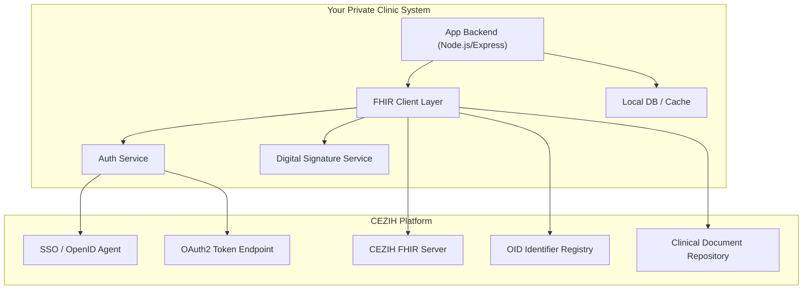

# CEZIH FHIR Integration — Implementation Plan

## Overview

This project implements a **FHIR R4**-based integration with Croatia's CEZIH healthcare system, specifically targeting **private clinic certification** (certifikacija privatnika). The goal is to pass all **22 test cases** required for CEZIH certification.

Based on:
- [CEZIH Osnova Guide v1.0](https://simplifier.net/guide/cezih-osnova/početna?version=1.0)
- [Klinički dokumenti Guide](https://simplifier.net/guide/klinicki-dokumenti)
- Test cases PDF: `Testni slučajevi_certifikacija privatnika.xlsx.pdf`

---

## Certification Test Cases Summary

| # | Test Case | IHE Profile / Mechanism | Priority |
|---|-----------|------------------------|----------|
| 1 | Auth with **Smart Card** | OpenID Connect Authorization Code Flow + TLS client cert | High |
| 2 | Auth with **Cloud Certificate** (Certilia mobile.ID) | OpenID Connect Authorization Code Flow + 2FA | High |
| 3 | Auth of **Information System** | OAuth2 Client Credentials Grant | High |
| 4 | Document signing — **Smart Card** | Digital signature on FHIR documents/messages | High |
| 5 | Document signing — **Cloud Certificate** | Digital signature on FHIR documents/messages | High |
| 6 | **OID Retrieval** | HTTP POST to Identifier Registry | High |
| 7 | **CodeSystem sync** | IHE SVCM ITI-96 (Query Code System) | Medium |
| 8 | **ValueSet sync** | IHE SVCM ITI-95 (Query Value Set) | Medium |
| 9 | **Healthcare Subject Registry** | IHE mCSD ITI-90 | Medium |
| 10 | **Patient Demographics** | IHE PDQm ITI-78 | High |
| 11 | **Foreigner Registration** | IHE PMIR (national extension) | Medium |
| 12 | **Create Visit** | FHIR Messaging | High |
| 13 | **Update Visit** | FHIR Messaging | High |
| 14 | **Close Visit** | FHIR Messaging | High |
| 15 | **Retrieve Existing Cases** | IHE QEDm (national extension) | High |
| 16 | **Create Case** | FHIR Messaging | High |
| 17 | **Update Case** | FHIR Messaging | High |
| 18 | **Send Clinical Documents** | HR::ITI-65 (IHE MHD Provide Document Bundle) | Critical |
| 19 | **Replace Clinical Document** | HR::ITI-65 (new version registration) | Critical |
| 20 | **Cancel (Storno) Clinical Document** | HR::ITI-65 (cancel previously registered) | Critical |
| 21 | **Search Clinical Documents** | HR::ITI-67 (Find Document References) | High |
| 22 | **Retrieve Clinical Documents** | ITI-68 (Retrieve Document) | High |

---

## Proposed Architecture



---

## Implementation Components

### 1. Security Layer (Test Cases 1-5)

#### 1.1 Transport Security
- **TLS/VPN** connection to CEZIH (configured at infrastructure level)

#### 1.2 Information System Auth (Test Case 3)
- OAuth2 **Client Credentials Grant Flow**
- Store `client_id` and `client_secret` from CEZIH registration
- Token endpoint returns JWT `access_token` (expires in ~300s) + `refresh_token`
- Include `Authorization: Bearer <access_token>` in all API calls
- Used for: OID retrieval, terminology sync (CodeSystem/ValueSet)

#### 1.3 End-User Auth (Test Cases 1, 2)
- OpenID Connect **Authorization Code Flow**
- **Smart Card** (Test Case 1): TLS mutual auth with user's digital certificate → PIN entry → session created
- **Cloud Certificate / Certilia mobile.ID** (Test Case 2): Redirect to SSO → Certilia login → push notification to mobile → callback with auth code
- Session managed via `mod_auth_openid_session` HTTP header
- Used for: Patient data retrieval, foreigner registration, visit/case management, clinical documents

#### 1.4 Digital Signatures (Test Cases 4, 5)
- All FHIR documents and messages must be **digitally signed**
- Smart Card signing (Test Case 4): Use certificate from smart card
- Cloud Certificate signing (Test Case 5): Use cloud-based certificate service

---

### 2. Registry & Terminology Services (Test Cases 6-10)

#### 2.1 OID Retrieval (Test Case 6)
```
POST https://cezih-server/fhir/oid-registry
Content-Type: application/json
Authorization: Bearer <system_token>

{
  "oidType": {
    "system": "http://ent.hr/fhir/CodeSystem/ehe-oid-types",
    "code": "1"
  },
  "quantity": 3
}
```
- Returns array of OIDs for document identification
- Max 100 OIDs per request

#### 2.2 CodeSystem Sync (Test Case 7)
```
GET https://cezih-server/fhir/CodeSystem?_lastUpdated=gt{date}
```
- Uses IHE SVCM ITI-96
- Hierarchical code lists use `parent-id` property
- Non-selectable structural codes marked with `notSelectable: true`

#### 2.3 ValueSet Sync (Test Case 8)
```
GET https://cezih-server/fhir/ValueSet?_lastUpdated=gt{date}
```
- Uses IHE SVCM ITI-95

#### 2.4 Healthcare Subject Registry (Test Case 9)
```
GET https://cezih-server/fhir/Organization?active=true
GET https://cezih-server/fhir/Practitioner?...
GET https://cezih-server/fhir/HealthcareService?...
```
- Uses IHE mCSD ITI-90
- Retrieves organizations, practitioners, and healthcare services

#### 2.5 Patient Demographics (Test Case 10)
```
GET https://cezih-server/fhir/Patient?identifier=http://fhir.cezih.hr/specifikacije/identifikatori/MBO|{mbo_value}
```
- Uses IHE PDQm ITI-78
- Can search by MBO, supports multiple patients in one query
- Returns: name, gender, birthDate, deceasedDateTime, identifiers (MBO, OIB), extensions (lastContact)
- Requires end-user authentication with specific roles

---

### 3. Patient & Case Management (Test Cases 11-17)

#### 3.1 Foreigner Registration (Test Case 11)
- National extension of IHE PMIR
- Register foreign patients using passport number or EU card number
- Can also update previously registered foreigner records
- Requires end-user auth + digital signature
- Allowed roles: dentist, specialist, physicians, etc.

#### 3.2 Visit Management (Test Cases 12-14)
All use **FHIR Messaging** mechanism:
- **Create Visit** (12): Send message to create a new patient visit (Encounter)
- **Update Visit** (13): Update an existing visit
- **Close Visit** (14): Close/finalize a visit

#### 3.3 Case Management (Test Cases 15-17)
- **Retrieve Existing Cases** (15): National extension of IHE QEDm — retrieve patient's health cases (EpisodeOfCare)
- **Create Case** (16): FHIR Messaging to create a new health case
- **Update Case** (17): FHIR Messaging to update an existing case

---

### 4. Clinical Documents (Test Cases 18-22) — **Most Critical**

For private clinics, the document types are:
- **Izvješće nakon pregleda u ambulanti** (Report after ambulatory examination)
- **Nalaz iz specijalističke ordinacije** (Specialist office finding)
- **Otpusno pismo iz privatne zdravstvene ustanove** (Discharge letter)

All use the **IHE MHD** profile with Croatian national extensions.

#### 4.1 Send Clinical Documents (Test Case 18)
- Uses national extension **HR::ITI-65** (Provide Document Bundle)
- Bundle contains: signed FHIR Document, DocumentReference metadata, List
- Documents must be digitally signed
- Document OID obtained from the OID registry (Test Case 6)

#### 4.2 Replace Clinical Document (Test Case 19)
- Uses **HR::ITI-65** with document replacement semantics
- Registers a new version of a previously submitted document

#### 4.3 Cancel (Storno) Clinical Document (Test Case 20)
- Uses **HR::ITI-65** with cancellation semantics
- Cancels a previously registered clinical document

#### 4.4 Search Clinical Documents (Test Case 21)
- Uses national extension **HR::ITI-67** (Find Document References)
- Search the document registry for patient's clinical documents

#### 4.5 Retrieve Clinical Documents (Test Case 22)
- Uses **ITI-68** (Retrieve Document)
- Download actual document content from the document repository

---

## User Review Required

> [!IMPORTANT]
> **Technology Stack Decision**: Before proceeding, we need to decide on the tech stack. Based on your existing CEZIH projects, I see you've been using **Node.js/Express** backends. Should we continue with this, or do you prefer a different approach?

> [!IMPORTANT]
> **Smart Card & Cloud Certificate Integration**: Test cases 1, 2, 4, 5 require integration with physical smart card readers and the Certilia mobile.ID service. These require specific hardware/SDK access and CEZIH-provided credentials. Do you already have:
> - Smart card reader hardware?
> - Certilia mobile.ID registration?
> - CEZIH `client_id` and `client_secret`?
> - VPN access to CEZIH test environment?

> [!WARNING]
> **Digital Signatures**: FHIR document signing requires access to the healthcare professional's certificate (either from smart card or cloud). This is deeply tied to the authentication mechanism. Does your existing system already handle this, or is this net-new?

> [!WARNING]
> **Terminology Functionality Restored**:
> 1. **Full ValueSet Persistence**: Updated `syncValueSets` to fetch `$expand` for all essential ValueSets and save the results in the `fullResource` column.
> 2. **On-Demand Remote Expand**: Restored the `getLocalConcepts` and `remoteExpand` functions to populate frontend dropdowns in real-time if local data is missing.
> 3. **Local ICD-10 "Zlatni Rudnik"**: Added direct lookup into the `diagnoses` table for instant MKB-10 results.
> 4. **Stability Guards**: Retained try-catch isolation and the global HTTPS agent to prevent sync crashes.

---

## Key FHIR Identifiers Used

| Identifier | System URI |
|-----------|-----------|
| MBO (patient) | `http://fhir.cezih.hr/specifikacije/identifikatori/MBO` |
| OIB | `http://fhir.cezih.hr/specifikacije/identifikatori/OIB` |
| EU Card | `http://fhir.cezih.hr/specifikacije/identifikatori/europska-kartica` |
| Passport | `http://fhir.cezih.hr/specifikacije/identifikatori/putovnica` |
| Visit ID | `http://fhir.cezih.hr/specifikacije/identifikatori/identifikator-posjete` |
| Local Visit ID | `http://fhir.cezih.hr/specifikacije/identifikatori/lokalni-identifikator-posjete` |
| Case ID | `http://fhir.cezih.hr/specifikacije/identifikatori/identifikator-slucaja` |
| Local Case ID | `http://fhir.cezih.hr/specifikacije/identifikatori/lokalni-identifikator-slucaja` |
| Referral ID | `http://fhir.cezih.hr/specifikacije/identifikatori/ID-uputnice` |
| HZJZ Worker # | `http://fhir.cezih.hr/specifikacije/identifikatori/HZJZ-broj-zdravstvenog-djelatnika` |
| Organization (HZZO) | `http://fhir.cezih.hr/specifikacije/identifikatori/HZZO-sifra-zdravstvene-organizacije` |
| Organization (HZJZ) | `http://fhir.cezih.hr/specifikacije/identifikatori/HZJZ-broj-ustanove` |
| IS Identifier | `http://fhir.cezih.hr/specifikacije/identifikatori/informacijski-sustav` |

---

## FHIR Resource Profiles (from CEZIH Osnova)

| Profile | FHIR Resource | Purpose |
|---------|--------------|---------|
| Pacijent | Patient | Croatian patient profile (MBO, OIB, last-contact extension) |
| Organizacija | Organization | Healthcare organization |
| Zdravstveni djelatnik | Practitioner | Healthcare professional |
| Posjet | Encounter | Patient visit |
| Slučaj | EpisodeOfCare | Health case |
| Ishod | Condition | Visit/case outcome |
| Radno mjesto | PractitionerRole | Work position |
| Zaglavlje poruke | MessageHeader | FHIR message header |
| Osnovni podatci FHIR poruka | Bundle (message) | Base FHIR message |
| Osnovni podatci FHIR Dokumenata | Bundle (document) | Base FHIR document |
| Podatci o procesu specijalističke uputnice | Task | Specialist referral process |

---

## Proposed Implementation Order

### Phase 1 — Foundation
1. Project setup (Node.js + TypeScript, FHIR client library)
2. Security layer: OAuth2 Client Credentials (Test Case 3)
3. OID retrieval service (Test Case 6)
4. Terminology sync: CodeSystem (7) + ValueSet (8)

### Phase 2 — Core Services
5. Patient demographics (Test Case 10)
6. Healthcare Subject Registry (Test Case 9)
7. End-user authentication: Smart Card (1) + Cloud Cert (2)
8. Digital signatures (4, 5)

### Phase 3 — Visit & Case Management
9. Visit management: Create (12), Update (13), Close (14)
10. Case management: Retrieve (15), Create (16), Update (17)
11. Foreigner registration (11)

### Phase 4 — Clinical Documents (Critical)
12. Send clinical documents (18)
13. Replace clinical document (19)
14. Cancel clinical document (20)
15. Search clinical documents (21)
16. Retrieve clinical documents (22)

---

## Verification Plan

### Against CEZIH Test Environment
- Each test case will be verified by executing the actual API call against the CEZIH test environment
- CEZIH provides a test FHIR server at their certification endpoint
- Test data (patient MBOs, organization IDs) will be provided by CEZIH for certification

### Manual Verification
- **Smart Card auth** (Test Case 1): Requires physical smart card reader + healthcare certificate
- **Cloud certificate auth** (Test Case 2): Requires Certilia mobile.ID account
- **Clinical document sending**: Verify document appears in CEZIH document registry after submission
- **Request user guidance** on access to CEZIH test environment credentials and test data
